A selection of projects I've made. See the [blog](/categories/) for more, or the
[archive](/post/) for everything in chronological order.

## Woodworking

### Cigar box ukelele
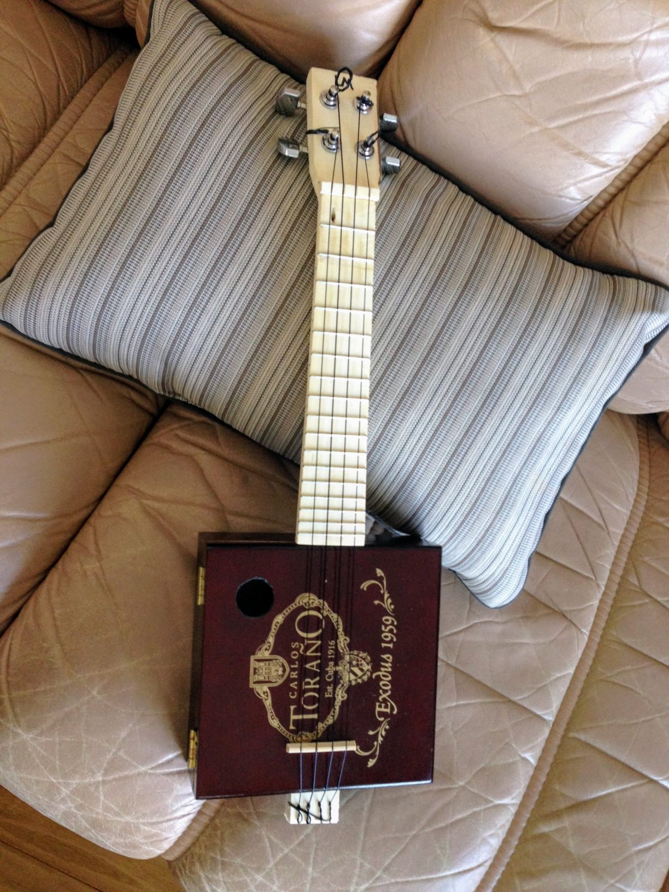

### Pen: Osage Orange
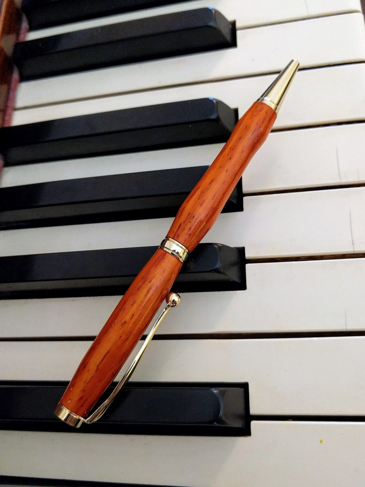

### Sliding-lid box
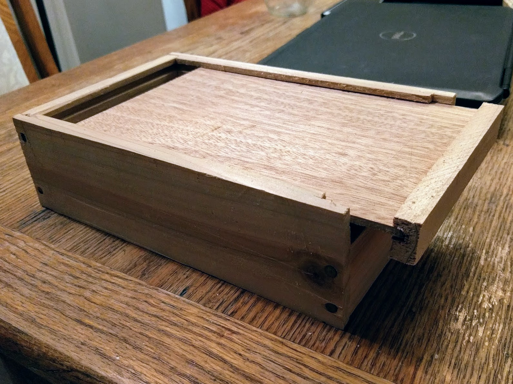

### Cedar box with integral hinge; cherry knob
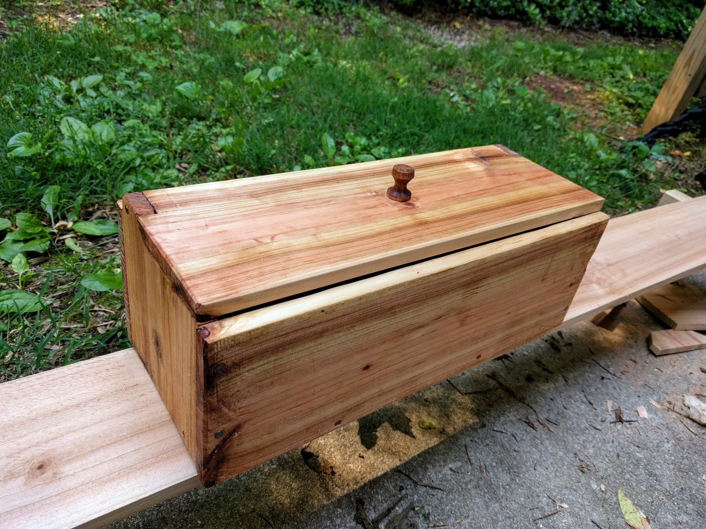
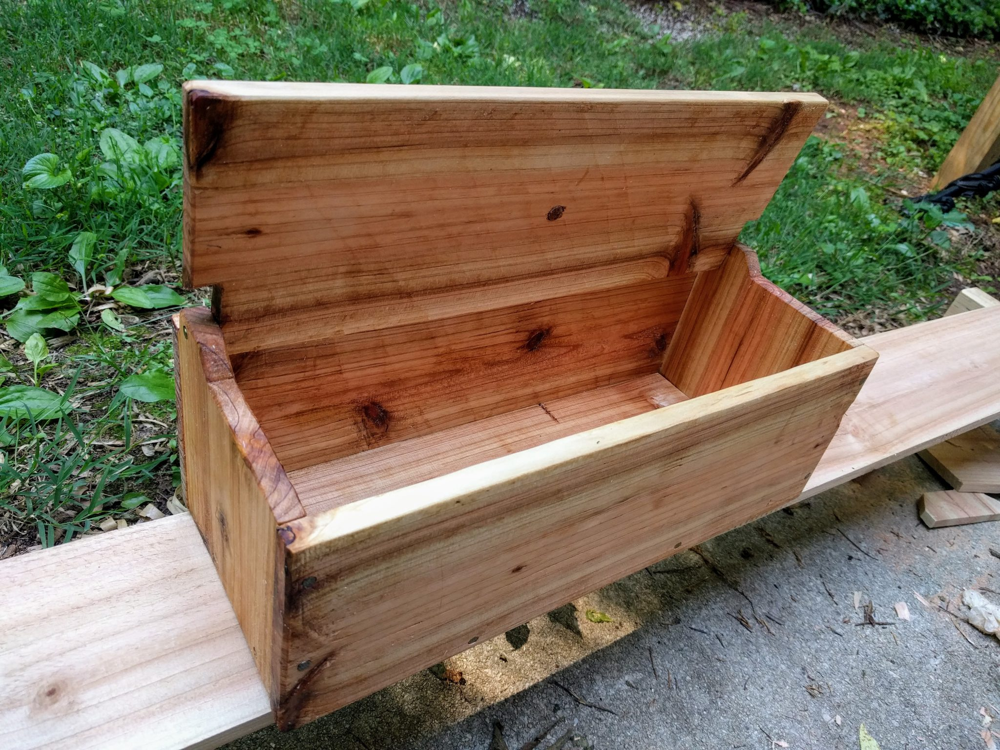

## Knives

### Friction folder in walnut
See the [friction folder knives post](/post/2019/02/19/friction-folder-knives/).

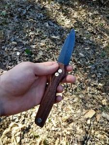

### Friction folder in Jatoba
See the [friction folder knives post](/post/2019/02/19/friction-folder-knives/).

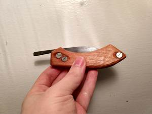
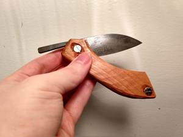
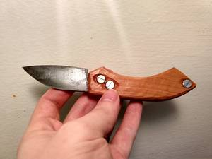

### Carving knife: 1095 steel (etched)
See the [carving knife part 2](/post/2018/07/31/the-carving-knife-part-2/) for the
full build and etch details.

### Karambit: 1095 steel, walnut handle
See the [karambit build post](/post/2018/03/13/karambit/) for the full build.

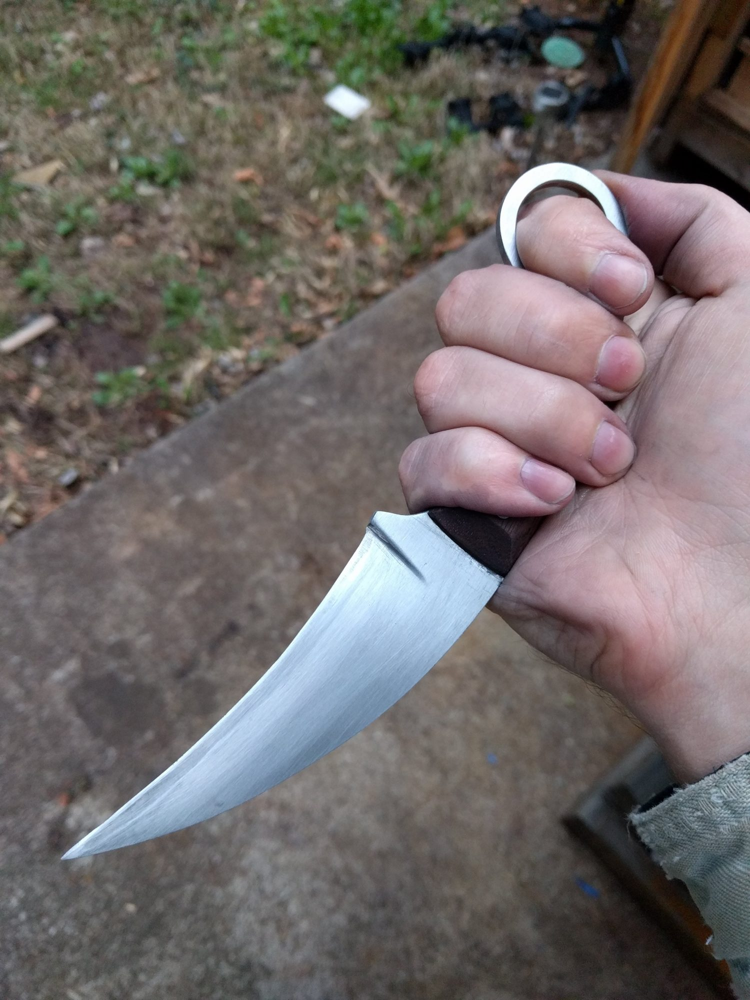

### Little hunter: 1095 steel, walnut handle
See the [little hunter build post](/post/2018/03/13/karambit/) for the full build.

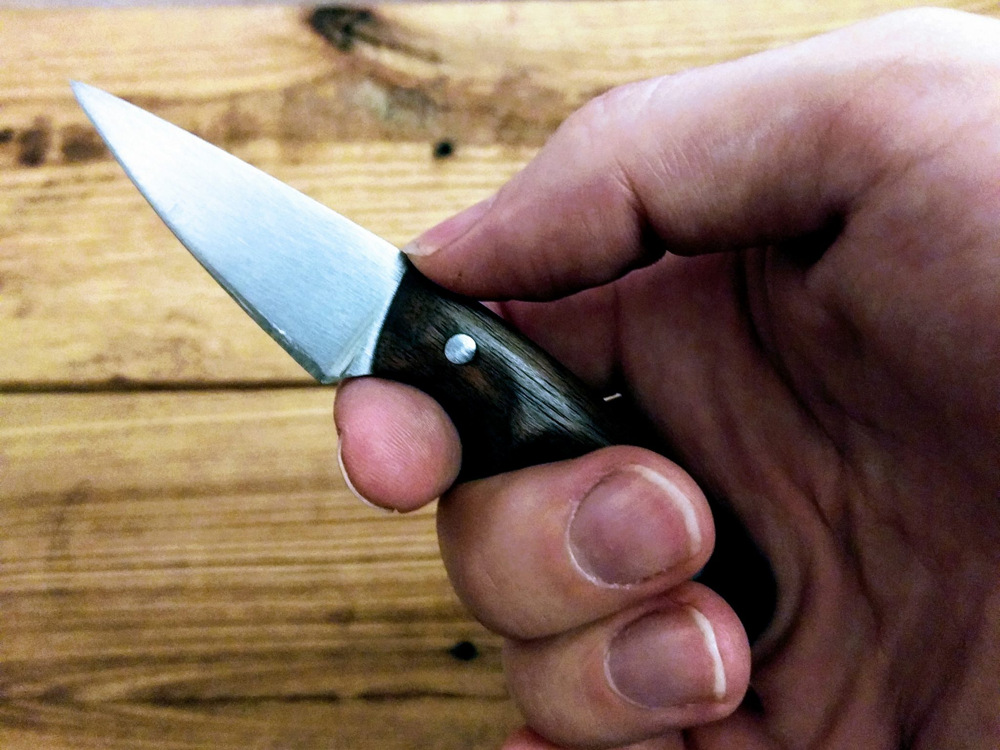
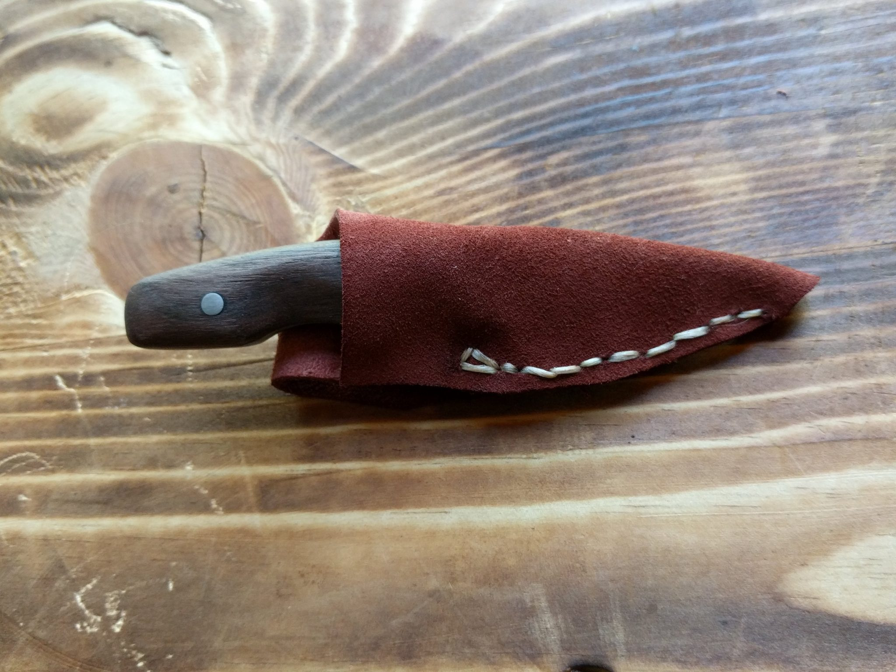
