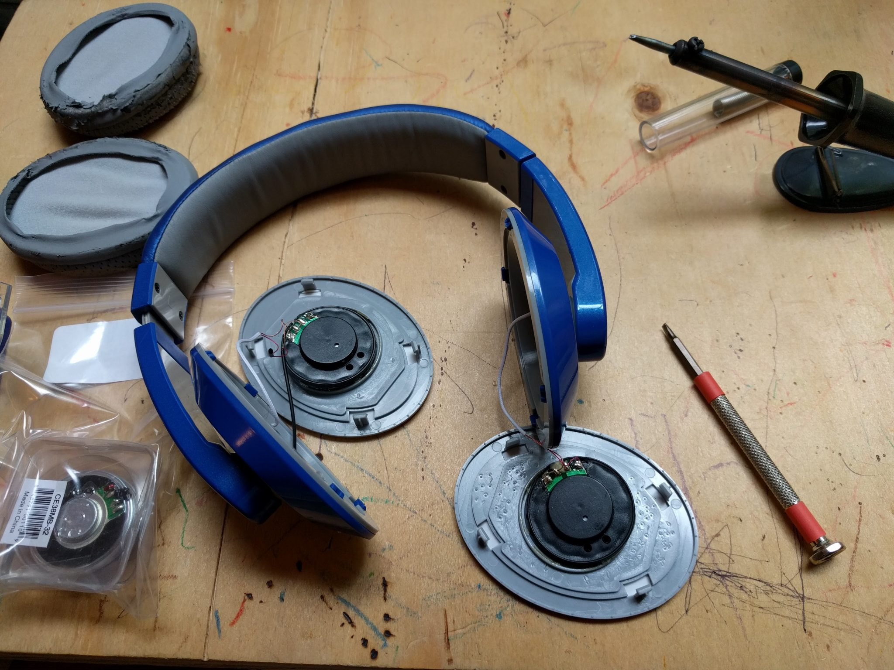

I have an old pair of headphones that I love. They don't sound good but they use an aux jack as the input cord. This means that I have been able to use these as a headset for making calls. While I have a bluetooth headset, they always seem to run out of battery when I need them. There's something relaxing about the reliability of a cord.

But they sound terrible.

So I opened the casing, measured the drivers (1-1/2") and ordered [replacements](https://www.parts-express.com/dayton-audio-ce-series-ce38mb-32-1-1-2-mini-speaker-black-32-ohm--285-131). Today I popped out the old ones, popped in the new ones and now have some of the best-sounding headphones I've ever used.

If you want to see audio stats these drivers, check out [homebrew headphones](http://homebrewheadphones.com/). He designed a pair of headphones to be 3D printed that use these drivers. Someday I intend to build his design, but for now my 3D printer doesn't have a large enough build volume. So instead I applied his experience to upgrading my old pair.

The only strange thing about the upgraded headphones is that I have to turn up the volume for the same sound. I am guessing that the drivers I replaced were a lower impedance. These are 32 ohms and sound wonderful, once I turn up the volume.
