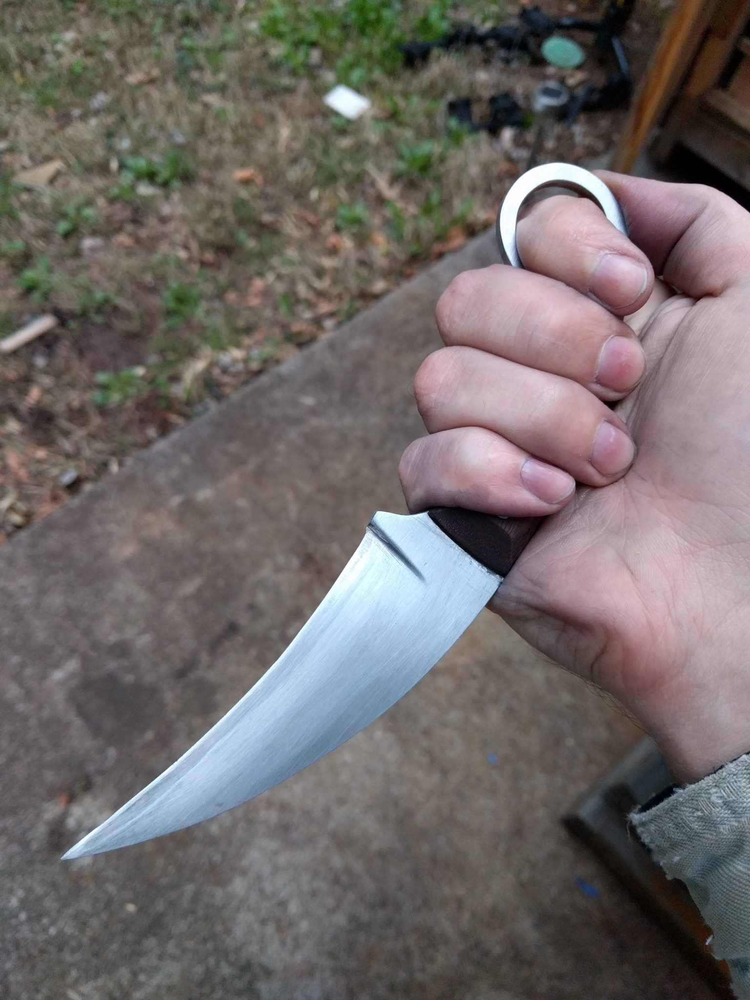
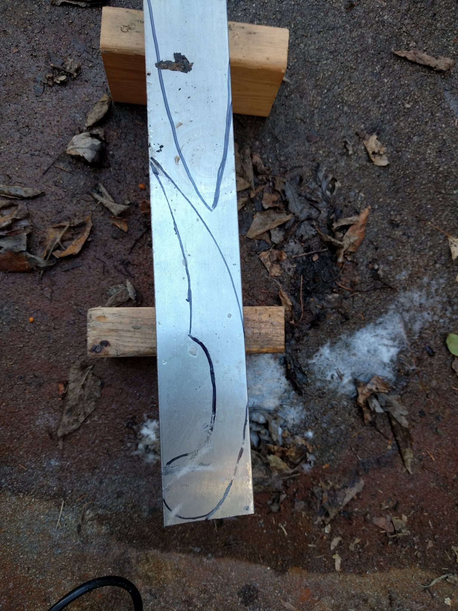
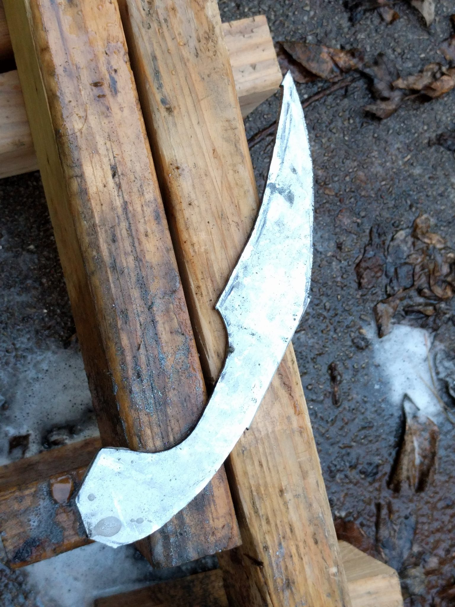
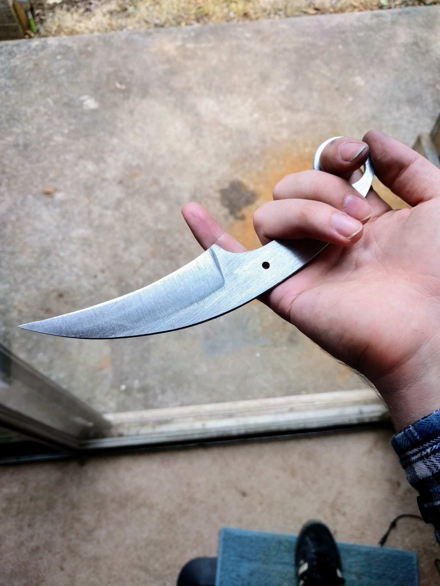
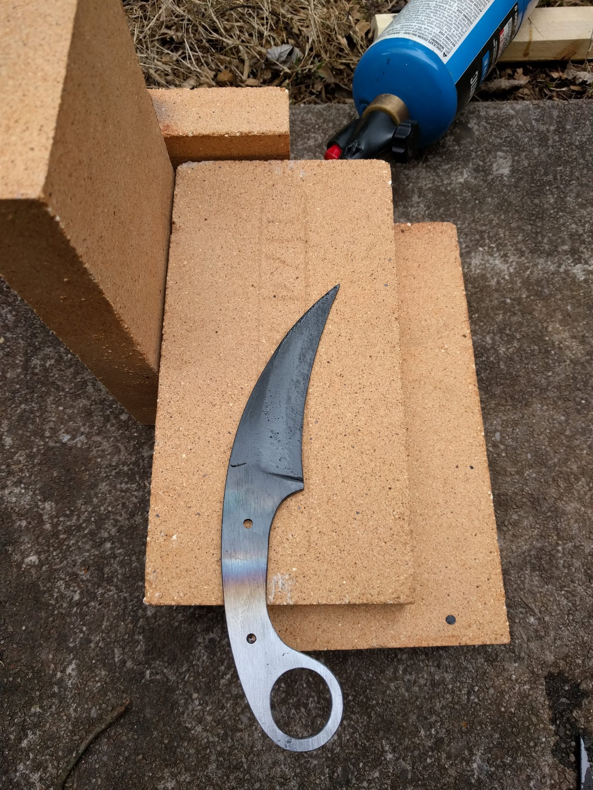
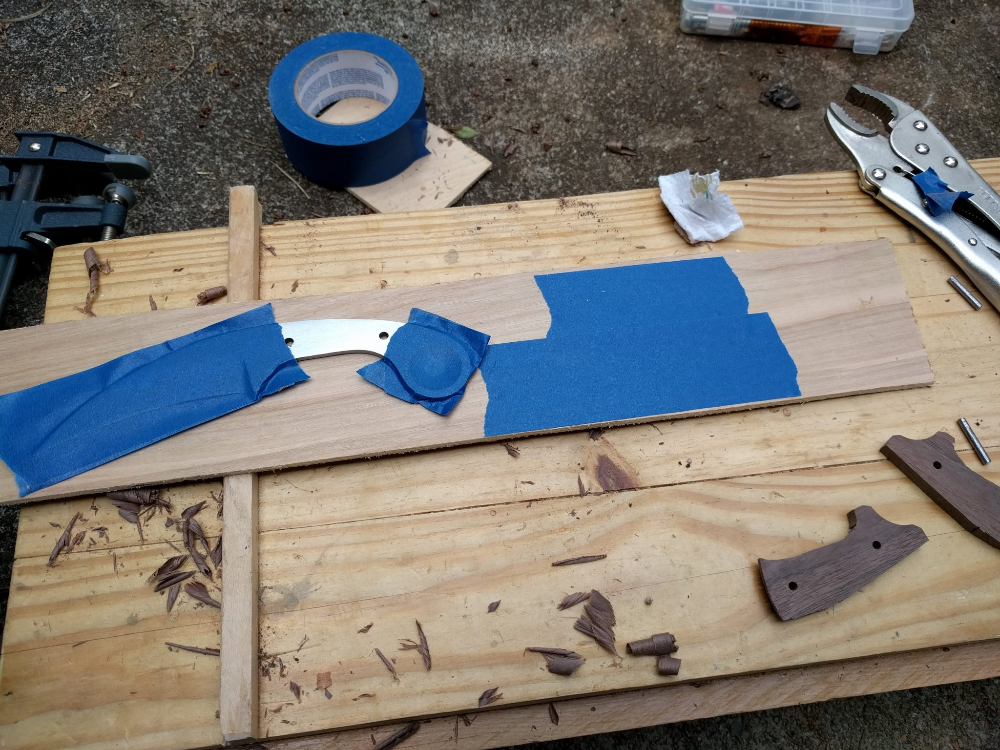
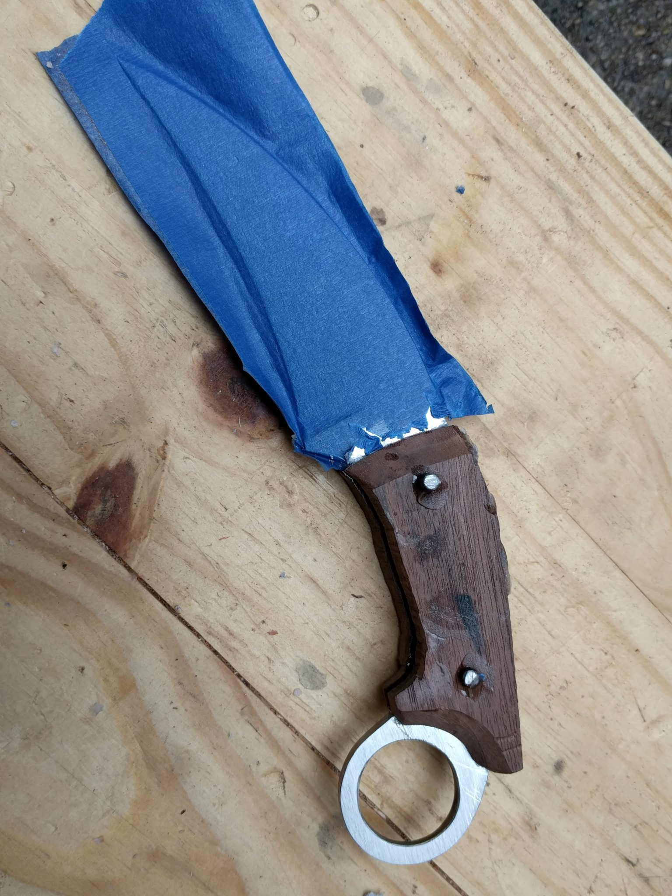
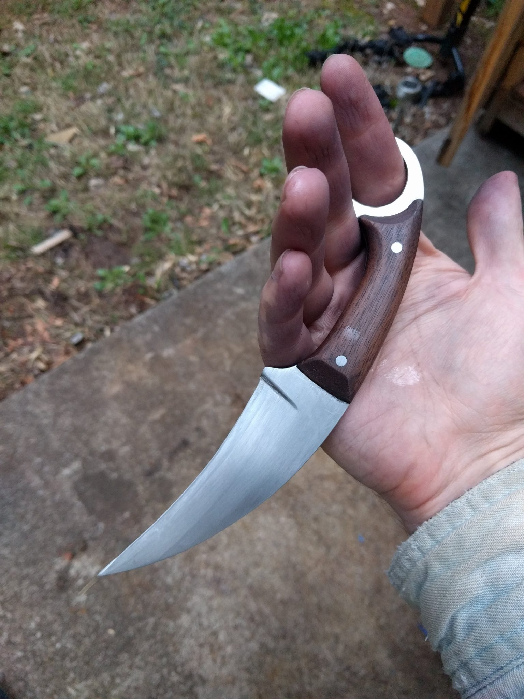

I have been making knives recently. Last night I finally completed the karambit I have been working on for over a month.

The karambit originates somewhere in Southeast Asia and has been found in Malaysia, Indonesia, Sumatra, and many other places. People think that it started as a farming implement before becoming a knife that reminded people of their neighborhood tigers. In other words, it's a farmer's tool that became a claw. I like that it originates as a knife used by the working class rather than the elite (that would be the [kris](https://en.wikipedia.org/wiki/Kris)).

I love this knife because

1. It is terrifying
2. It is a fascinating cultural artifact
3. I made it

## Making

Like all of my knives so far, this one started out as a bar of 1095 steel.

Then I cut and ground it until it was the right shape. I used a jigsaw with a metal cutting blade and then a 3x21" belt sander with a variety of belts.

I hardened it in a pile of bricks with a propane and map torch. I tempered in the oven.

Then I sanded the knife until it was shiny. I cut some handle blanks out of a chunk of walnut and then masked off the blade and ring.

I used 5-minute epoxy to glue the handle to the knife. The pins are just nails cut to length with a hacksaw.

Finally I sanded down the pins and handle and sharpened the knife. A little bit of oil and it is ready to go.

I think I'll sell this one if I can find someone interested in handmade knives. Unfortunately, I started making it before [the game with Joel](/2018/02/double-or-nothing/) so I won't be able to count it towards beating him. But I have other knives in the pipeline for that.
