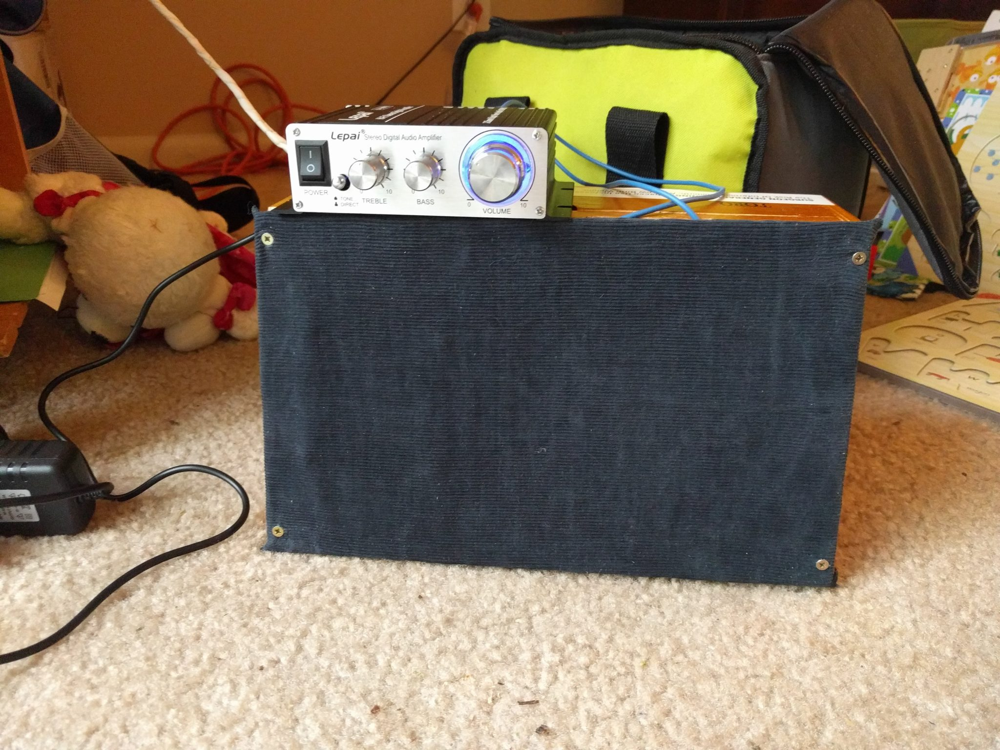
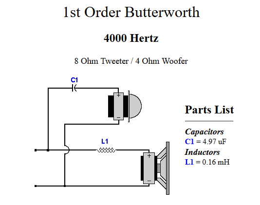
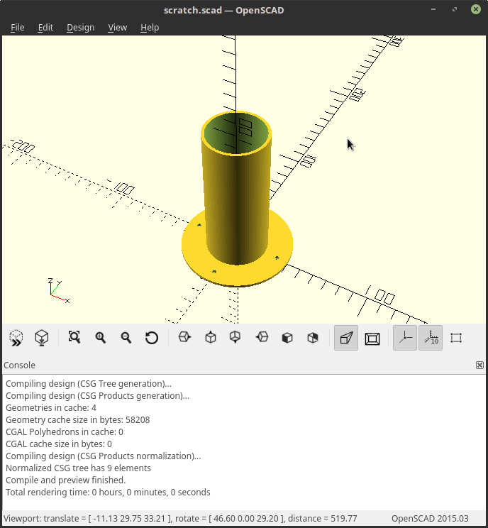
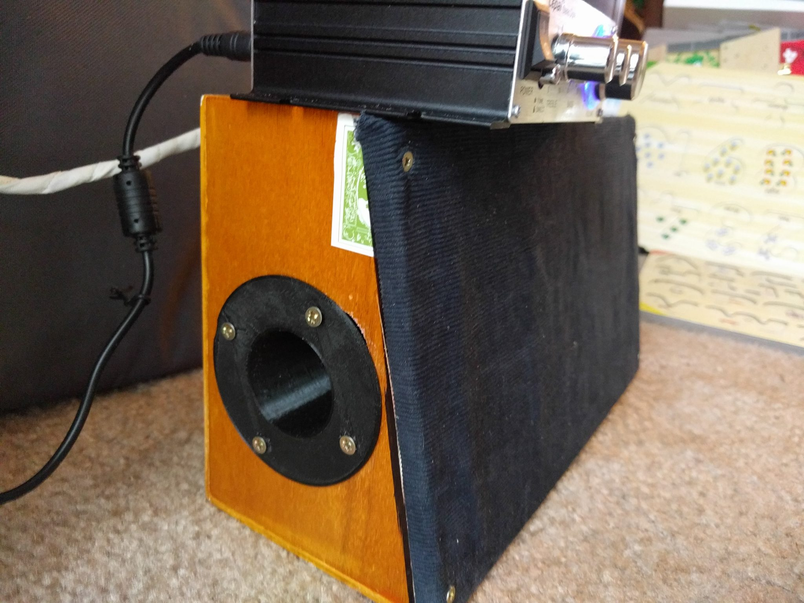
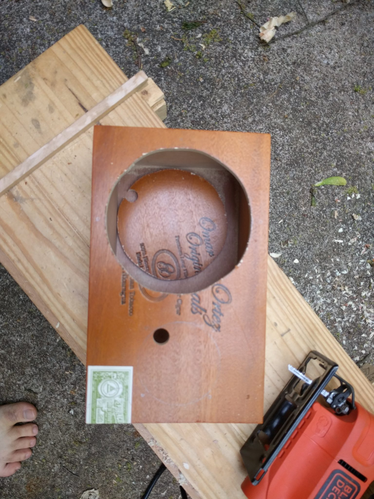

This weekend I built a mini cigar box amplifier to use when I finish my bass guitar.

To be more precise, I built the speaker box. The amp is a little standalone unit that sits on top.

This is the second iteration of my practice amp build. At first I tried to build a sealed enclosure out of OSB. OSB is miserable for anything other than shelving and walls. After much frustration I switched to using a cigar box amp with a ported design.

# Design considerations

## Crossover

In this build I decided that I wanted to learn a little bit more about speaker design so I built in a crossover circuit.

For those of you unfamiliar with crossovers, they are basically a series of frequency filters that keep high notes from getting to the woofer and low notes from getting to the tweeter. This keeps the large and small drivers from destroying themselves by trying to reproduce frequencies that don't match their design.

Oh yeah, and they sound better too.

Since this was going to be a simple speaker I went with a 1st order Butterworth design. This just means adding a capacitor to the tweeter to filter out low frequencies and then adding an inductor to the woofer to filter out the highs.

I calculated my electronic values using [www.diyaudioiandvideo.com](https://www.diyaudioandvideo.com/Calculator/SpeakerCrossover). This was what it came up with:

## Enclosure

The size and shape of the box you stuff your speakers into matters. There are certain volumes and shapes that will fit the speakers you're using, and there are many others that won't.

Based on the [Thiele/Small parameters](https://en.wikipedia.org/wiki/Thiele/Small_parameters) (magic numbers that tell you things) of my speakers I found that if I wanted to make a sealed box it should have a volume of about 1.5 ft3. This is too large for what I'm going for.

So I instead added a [bass reflex port](https://en.wikipedia.org/wiki/Bass_reflex). I used the magic numbers to again tell me the sizing of the port to match the cigar box I wanted to use. Then I built the port in CAD and printed it out.

Printed, it looks like this:

# Assembly

## Fitting the drivers I started by cutting out circles for the speaker drivers.

It was soon after this that I realized that I correctly measured the speaker diaphragm but forgot how much bigger the metal rim was. The short story was that my woofer wouldn't fit in the box.

In the end I made 2 on-the-fly design changes that meant that all my calculations went out the window.

1\. I cut part of the metal rim of the woofer and bent it back 2. I cut the sides of the box so that the front would angle back, increasing the effective width of the speaker front.

This is where things started going crazy and I forgot to take pictures. Eventually I got the speakers and the port mounted so that the box would close.

## Soldering the components

I followed the wiring diagram for the crossover and connected positives together and negative. I tested for continuity with a multimeter to make sure I had good solder connections.

## Adding cover

By this time the front plate looked pretty terrible, so I employed my amateur bookbinding skills to add a cover of navy blue corduroy.

I used hot glue to seal the cover and four screws to secure the cover and the lid to the rest of the box.

# Testing

I connected the amplifier and played the speaker for several hours. It sounded better after playing for a few hours.

This speaker has a huge sound for the size of the box. I guess that comes from the bass reflex port. It sounds quite good and should work well.

# Next steps

I still need to mount the amplifier and the 1/4" instrument jack. I built a mounting bracket for the 1/4" jack in CAD and then 3d-printed it out, but I have yet to attach it to the box.

Then, if I want to use this as a computer speaker as well, I need to downmix my stereo signal to mono. I think this should be simple in linux.

# Conclusion

I am happy for the practice this gave me in turning spec sheets into a working design. There were some snags but I am proud of the finished product. I learned more about speaker design and I ended up with an amp that does exactly what I want.

Do you have any critiques or experience to share? Leave it in the comments. Do you want to commission me to build you a cigar box speaker? [Contact me](/about/).

Thanks for reading.
