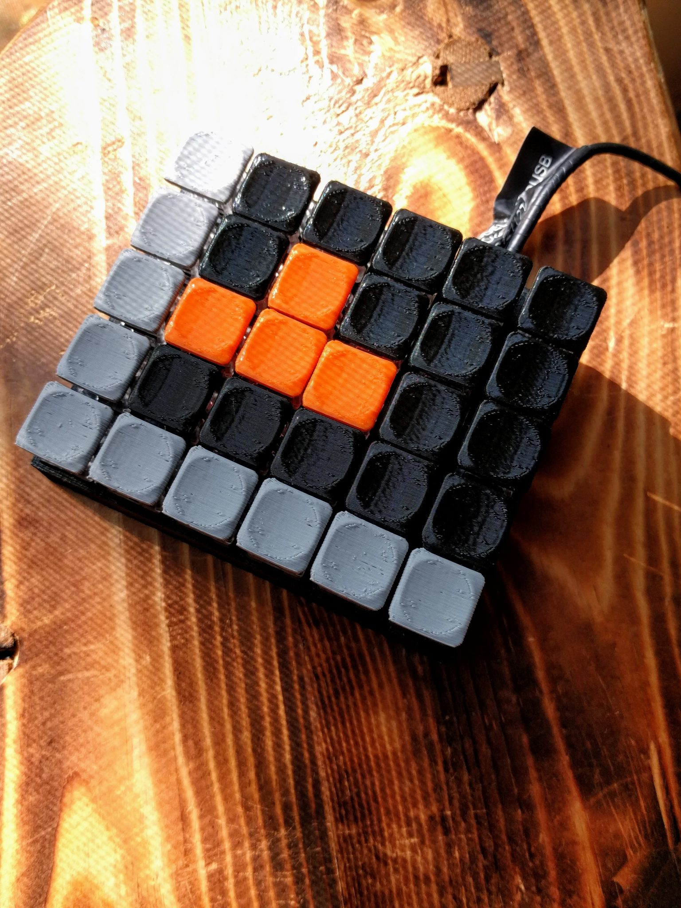
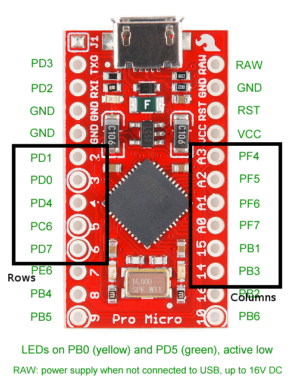
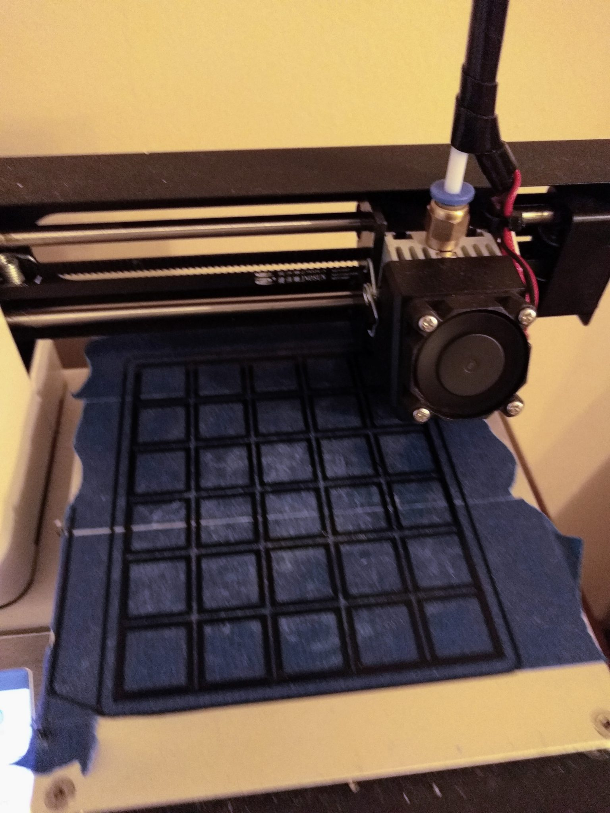
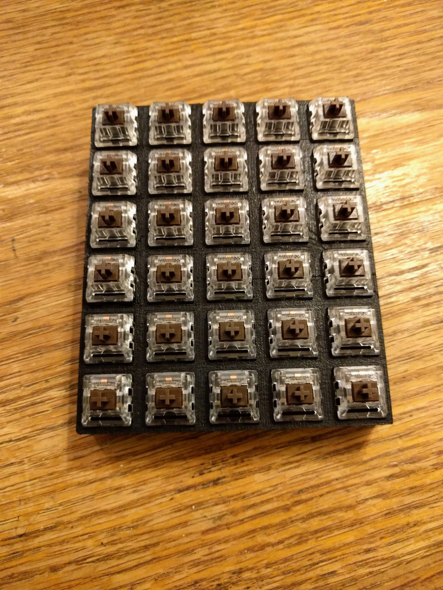
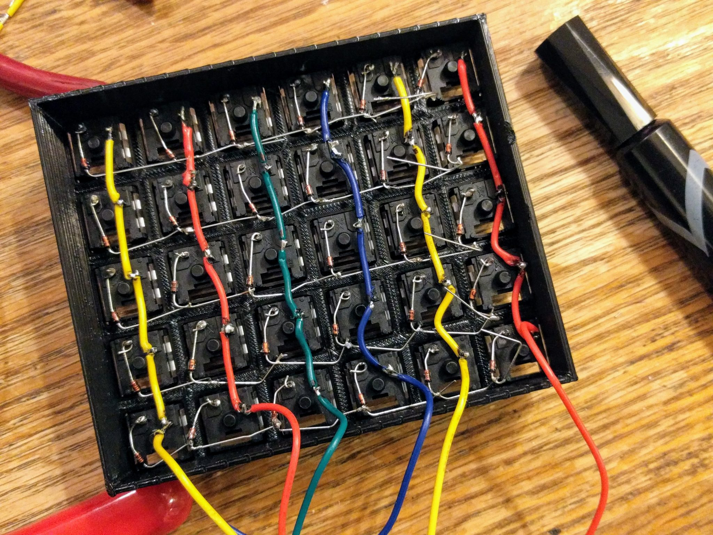
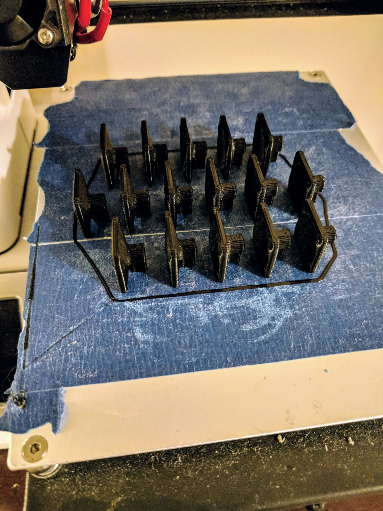
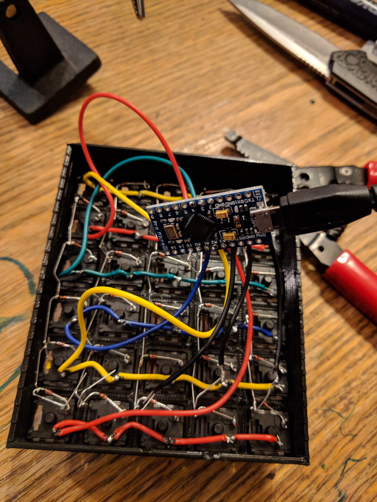
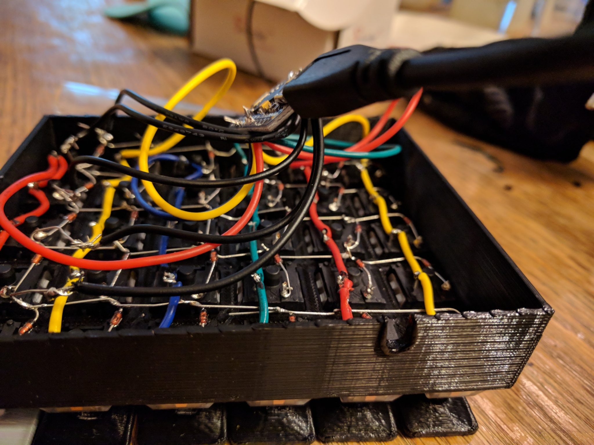

I wanted to build a left-handed gaming keyboard, mostly to see if I could. Here's what it looks like:

# Constraints

There actually are already one-handed gaming keyboards on the market. They range from the $130 setups from reputable brands to $25 no-name Chinese gadgets.

It was important to me to: - build this myself - spend less than $25 - use mechanical keys (because they are so much more awesome)

# A review of the field

Mechanical keyboards are shockingly expensive. It is normal for people to pay $175 for solder-it-yourself kits.

The most economical pre-designed solution would be to purchase a [let's split](https://github.com/climbalima/let-s-Split-v2/tree/master/lets_split) pcb and build just one half. Unfortunately this design doesn't have a dedicated number row. That's really helpful for many games and I didn't want to go without.

# DIY build

I soon realized that the best option for me would be to design my keyboard from scratch and just wire it by hand.

## Microcontroller

I used an Arduino Pro Micro to read the switches and send keypresses to the computer. This controller uses the Atmega32u4 chip which can pretend to be a usb keyboard. A quick google image search showed me what chip pins corresponded to the Pro Micro's pinout.

## Switches

I knew I wanted a mechanical keyboard so I ordered the cheapest mechanical switches I could find. I ended up with 30 Gateron Brown switches from aliexpress. These are perfect for a gaming keyboard because they require a fairly light actuation force.

## Case

I decided on a straight layout of 6X5 switches. I used calipers to measure the switch dimensions and then created the case model in OpenSCAD. I built the spacing with 3mm margins. This allowed the whole thing to fit on the bed of my little 3D printer.

Once the case finished printing I snapped in all 30 switches and flipped it over.

## Diodes

The way a keyboard like this works is that a microcontroller reads a matrix of switches and figures out which one is pressed by sensing the current going from a row to a column.

To make sure that the microcontroller doesn't get tricked by adjacent keys I added a diode to each key in each row.

## Soldering

This was honestly the fun part. Once I had all my components laid out I started soldering diodes to the left pin on each switch. I connected each row together with the tails of the diodes.

To connect the columns I laid a wire down and marked the areas where it would intersect with the switch pins. Then I stripped the wire at each of those locations and soldered it to the switches.

When that was finished I checked my firmware layout and soldered the columns and rows to the appropriate pins.

## Firmware

The firmware I used was [QMK](https://github.com/qmk/qmk_firmware). But I didn't need to program it myself; I used two websites to figure it out for me.

1\. The layout - I used http://www.keyboard-layout-editor.com to set up my layout. - Then I copied the layout to http://kbfirmware.com/. 2. The mapping - I created this in 2 layers: the base layer as the left-hand keyboard keys and then a second numpad layer.

## Putting it together

I printed 30 keycaps in three different colors and trimmed them to fit.

Then I put it all together and connected it to my computer.

One funny thing is that I forgot a hole for the USB cable. But it was super easy to use the soldering iron to melt a slot in the side.

## Testing

Success! It worked on the first try. I pushed buttons and saw characters show up on my screen.

I did need to do a few firmware revisions before getting it to act exactly as I wanted. Now there is a base later that is a normal left hand of a keyboard. Then there is a numpad layer that also has volume and media keys.

So I now have a gaming keyboard that can also act as a numpad. It's a joy to use since it works well and everything I type on it I think _I made this_.

# Resources

Here are some links to components and resources I used to build this: - [My keyboard case and keycap models](/wp-content/uploads/2018/04/keyboard-cad-1.zip) - [My firmware files](/wp-content/uploads/2018/04/qmk-firmware-files.zip) (the .hex file is what you actually flash to the arduino). - [Arduino Pro Micro](https://rover.ebay.com/rover/1/711-53200-19255-0/1?icep_id=114&ipn=icep&toolid=20004&campid=5338300398&mpre=https%3A%2F%2Fwww.ebay.com%2Fitm%2FPro-Micro-ATmega32U4-5V-16MHz-Leonardo-Replaces-ATmega328-Pro-Mini-Arduino%2F192111119180%3Fhash%3Ditem2cbab70b4c%3Ag%3A-~4AAOSwCU1YrZ3I%3Asc%3AUSPSFirstClass!37923!US!-1)* (* = affiliate link) - [Gateron brown keys](https://rover.ebay.com/rover/1/711-53200-19255-0/1?icep_id=114&ipn=icep&toolid=20004&campid=5338300398&mpre=https%3A%2F%2Fwww.ebay.com%2Fitm%2F10x-Brown-3-Pin-Mechanical-Switch-Keyboard-Replacement-for-Gateron-RGB-Series%2F232418577119%3Fhash%3Ditem361d3a0adf%3Ag%3AeSEAAOSw0UNZcazh)* - [1N4148 diodes](https://rover.ebay.com/rover/1/711-53200-19255-0/1?icep_id=114&ipn=icep&toolid=20004&campid=5338300398&mpre=https%3A%2F%2Fwww.ebay.com%2Fitm%2F222926154112%3FViewItem%3D%26item%3D222926154112)*

# Conclusion

I may make another of these to complete the full keyboard. Or I may just leave it as a numpad. What do you think? What keys would you map if you had a custom keyboard? Let me know if you build one of these. I'd love to see it.

Thanks for reading.
