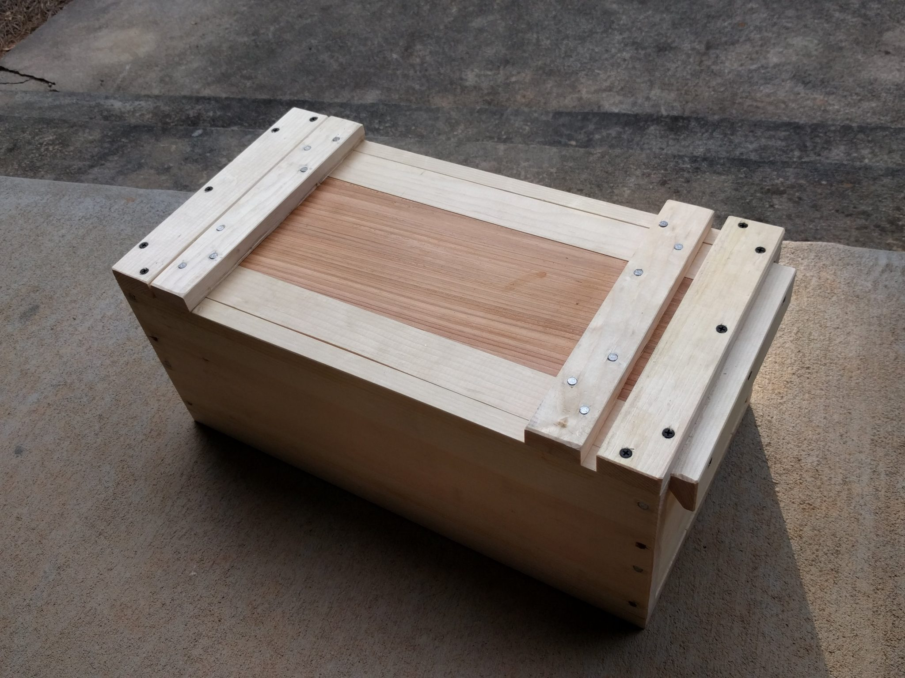
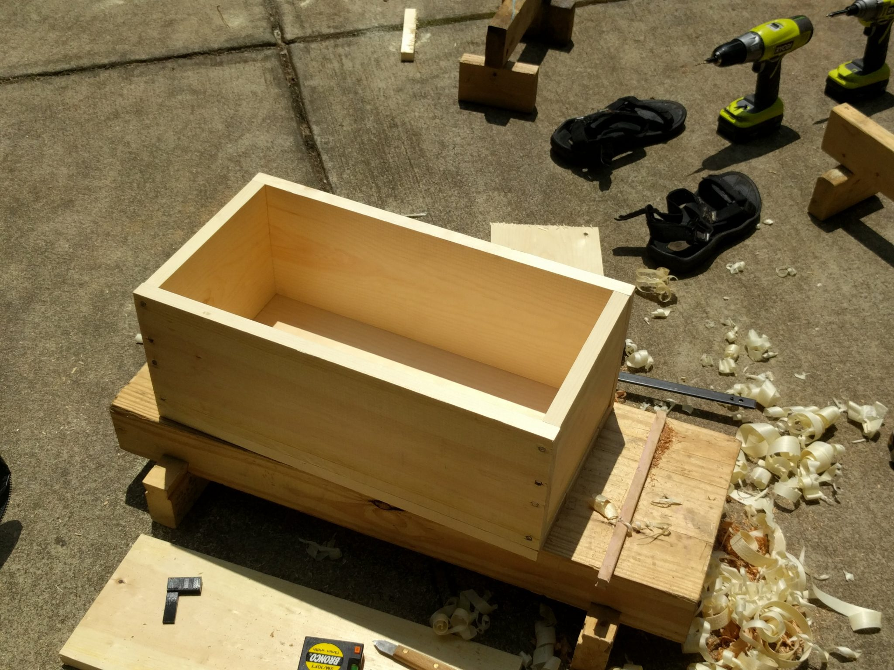
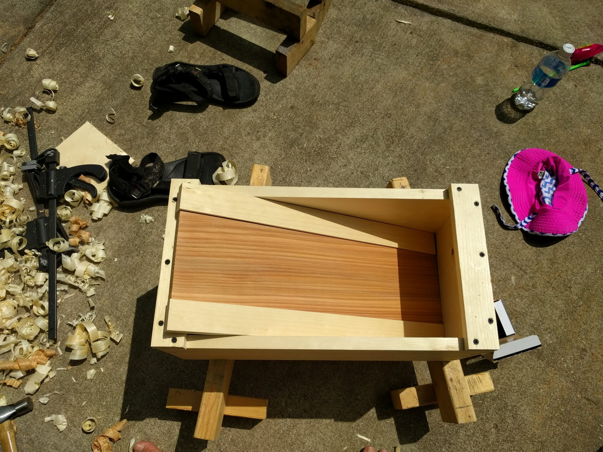
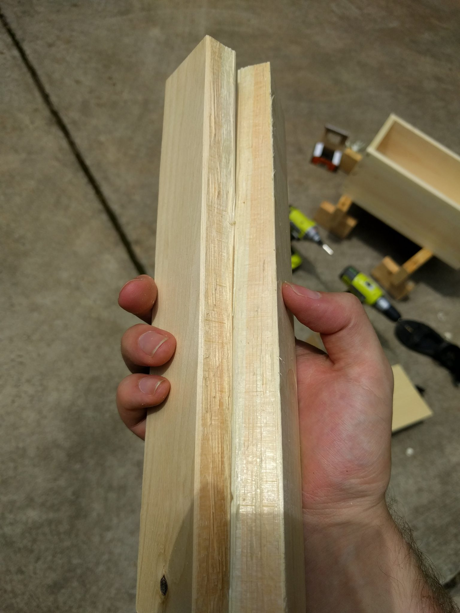
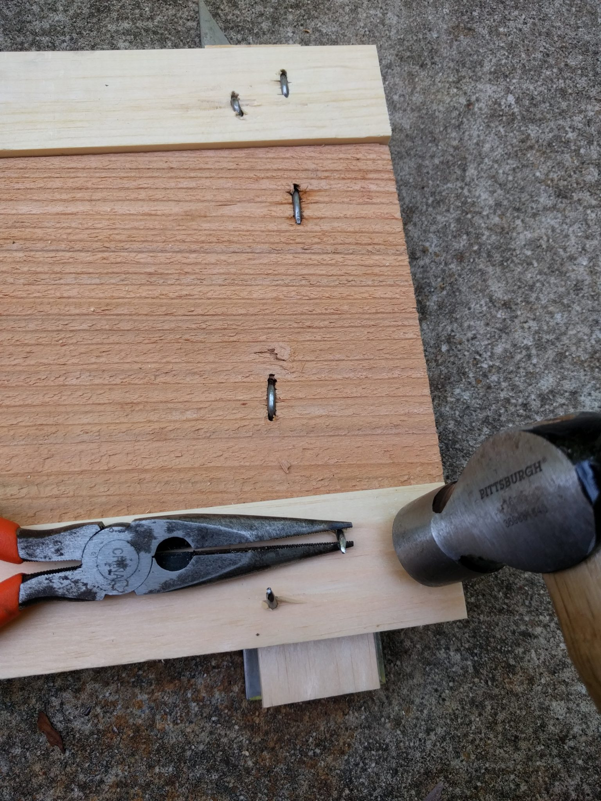
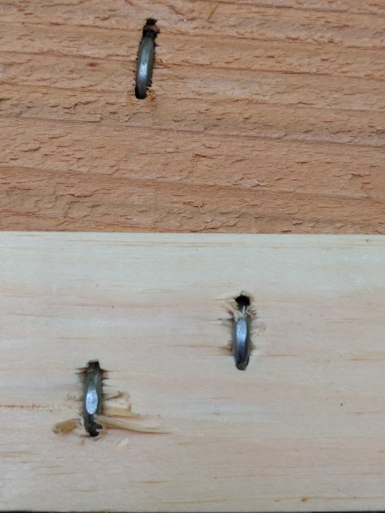
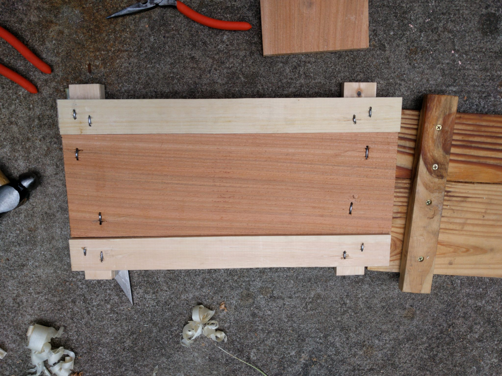
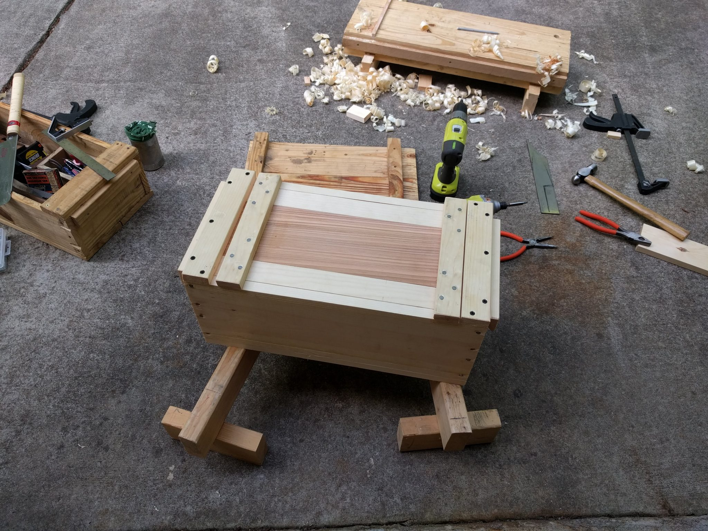

Today I trekked to home depot where I bought a 12-foot long 8-inch by 1-inch pine board. This board would become a toolbox.

The Japanese style toolbox is a versatile form. I first encountered it in Toshio Odate's, [Japanese Woodworking Tools, their spirit and use](https://rover.ebay.com/rover/1/711-53200-19255-0/1?icep_id=114&ipn=icep&toolid=20004&campid=5338300398&mpre=https%3A%2F%2Fwww.ebay.com%2Fitm%2FJapanese-Woodworking-Tools-Their-Tradition-Spirit-and-Use-Paperback-or-Softb%2F112952282675%3Fepid%3D761222%26hash%3Ditem1a4c7b0e33%3Ag%3A320AAOSwdGFYrYfn). I already use one of these toolboxes all the time for my woodworking tools.

So why do I need another one? I don't. This one is for my brother who recently got married (who is probably not a regular reader here and probably won't see this. Shhh). An important part of independence is using tools to make and fix things, right?

I started by deciding on the side length. My toolbox is 24 inches long, which is a good length. But my toolbox is only about 6 inches high. This one will be 8, so I went with a shorter length to keep it from getting too large and heavy. 20 inches. I cut 6 of these lengths and then sat down to figure out how wide to make it.

The width of the toolbox was determined by the width of the lid. I decided to make the lid out of a cedar picket plus some of the same pine board. This looks cooler. The cedar board was narrower, only about 6 inches. So I ripped one of the pine boards in half, ripped that half in half again, and put the strips on either side of the cedar. This was my lid, so this would be the width of the toolbox.

After figuring that out it came together pretty easily. I simply drilled and nailed the box together. Then I put the bottom on it with screws.

Then I planed the top of the cedar and then planed the edges to make sure that all three lid pieces fit in the box. They did.

Next I needed to make 4 battens for the top. These were fun because I didn't actually rip them with the saw. Instead I used my homemade marking/splitting gauge to split them. This worked wonderfully.

 Just split

I screwed two of these on either end of the toolbox. Then I returned to the lid. I pushed all three lid pieces under a batten and marked a line across. Then I drilled and nailed through the lid batten and the lid pieces. I turned it over and clinched the nails.

In case you aren't familiar with this process, it's basically turning a nail into a staple. You drive it all the way two pieces and then pound it over on the back. I find that it's helpful to start a curve in the nail with a hammer and needlenose pliers. This helps bury the tips.

With one side of the lid set I cut the others so that they would fit in the lid when the other was tight. Then I added the other batten.

The magic of the Japanese toolbox is in the sliding lid. You put one end under the batten on the box and then the other end falls in place. Slide the entire lid that way and it jams shut. Some people add wedges so that the lid can't open further but I've found that the friction of the wood is excellent at keeping it closed.

And there it is, ready to hold some tools.

Thanks for reading!
