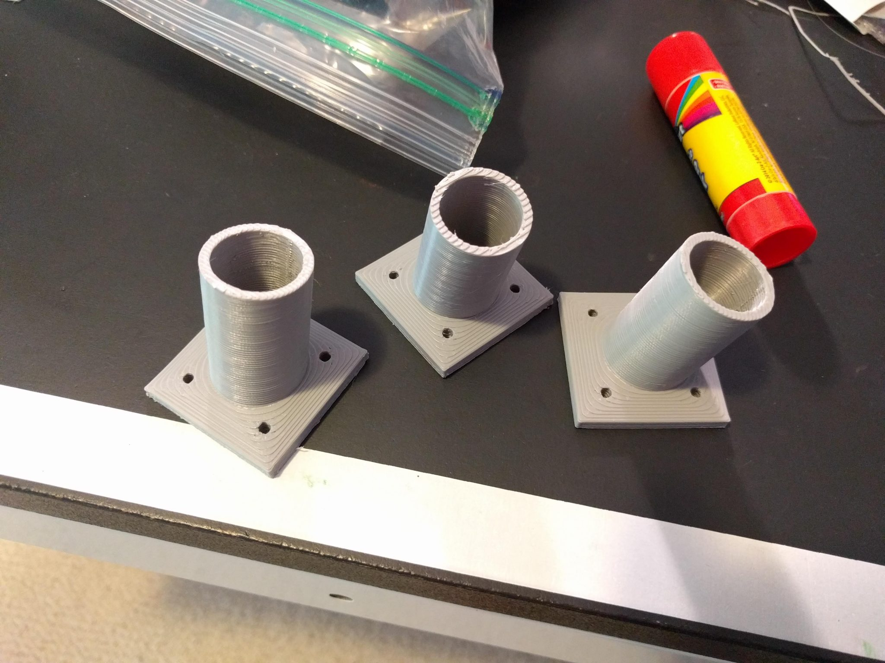
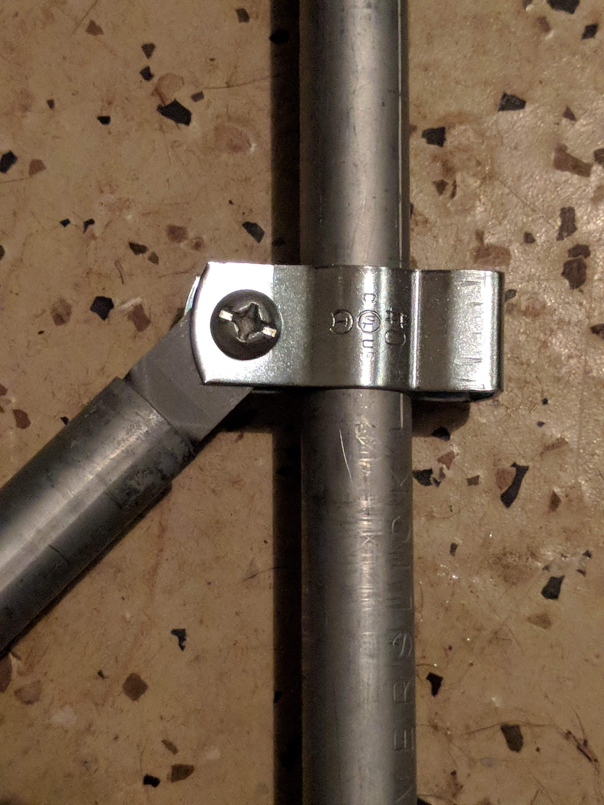

I like the potential of electrical conduit for construction. I've seen people sell expensive connectors that turn these into a construction set, but why do that when I have a 3d printer?

I modeled some tabletop connectors in OpenSCAD and then some tenons that go in the end of a piece of conduit and then connect with conduit hanger clamps.

Hopefully these will allow me to build a simple standing desk that is sturdy and lightweight.

Stay tuned for results.
