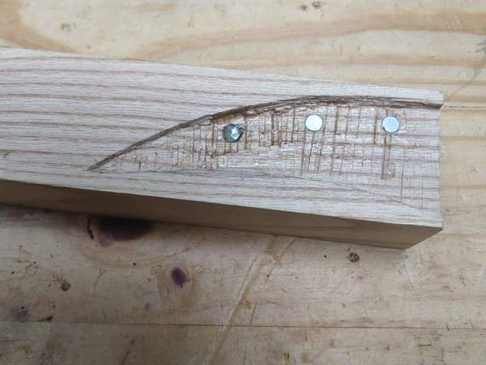
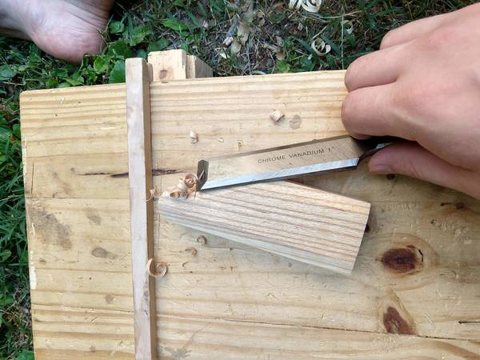
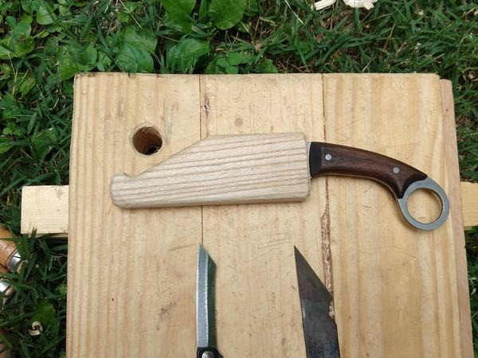
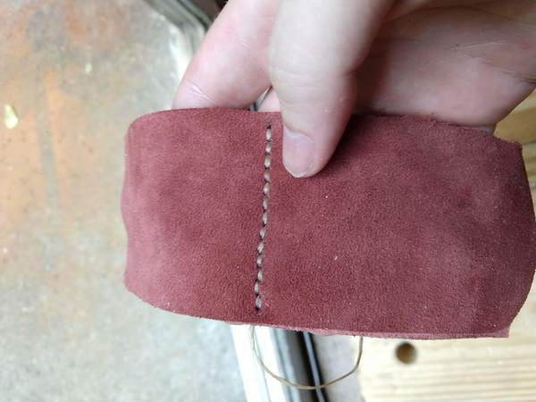
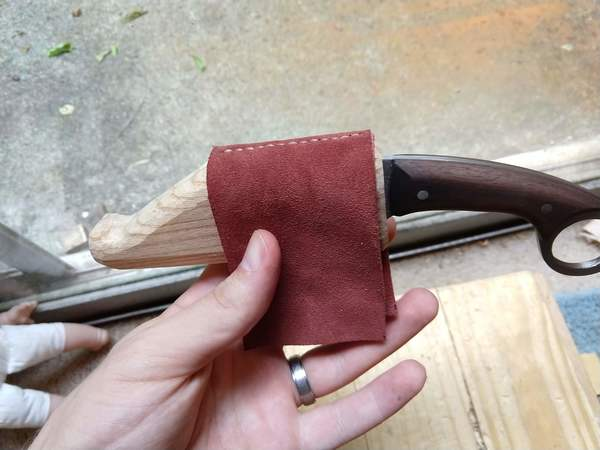
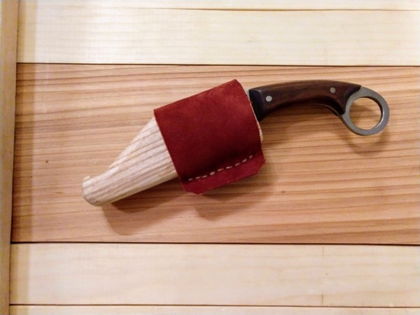

# On its way

Today I put the [karambit](/2018/03/karambit/) into the mail. It is on its way to the (hopefully happy) owner.

Before the knife was ready to ship I needed to make a case for it. Instead of a traditional leather sheath I decided to go with a wooden case. I borrowed a little bit from the construction of a Japanese katana sheath, splitting it down the middle and carving out the profile of the knife into one side.

Because I was planning for this to be a horizontal carry sheath, I added 3 neodymium magnets. These keep the knife from slipping out.

After gluing up the two halves I planed and carved the case.

Then I added a double-layer leather wrap. The inner layer is glued to the case, while the outer layer is sewed at the top and bottom. This makes the belt loop.

There is just enough room for a belt to slip in, yet not enough room for the knife to slip around when you're carrying it.

Thanks for reading!
