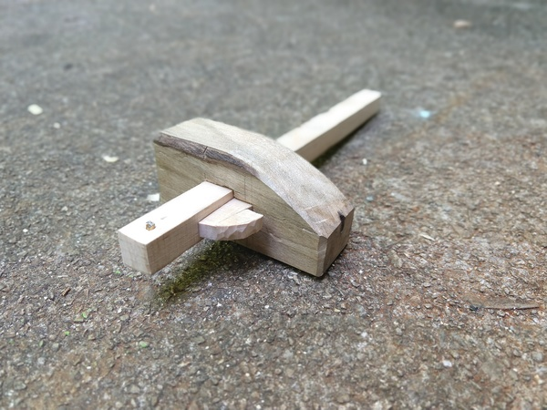

I have been getting my brother into woodworking. We went tool shopping yesterday and came out with a huge haul.

Last night I was showing him how to flatten the backs of his chisels and he asked, “When would you want to hit the chisel with a hammer?” So I pulled out my chisels and some scrap wood and built him this.

When chopping mortises, hammers are very nice.

This is a marking gauge, a very useful tool to mark lines parallel to the edge of a board.
