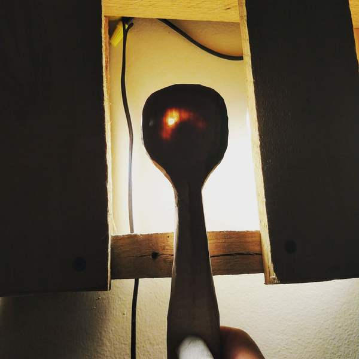
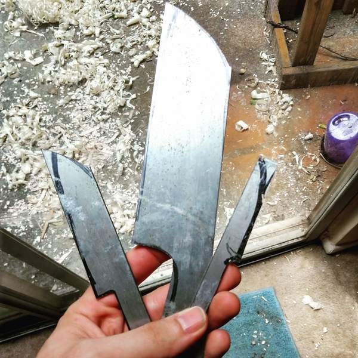
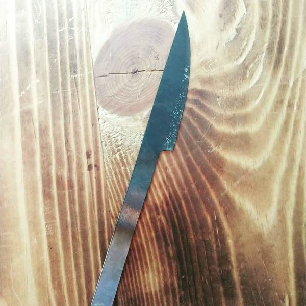
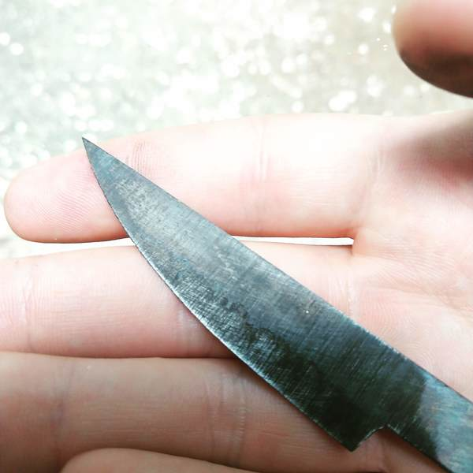
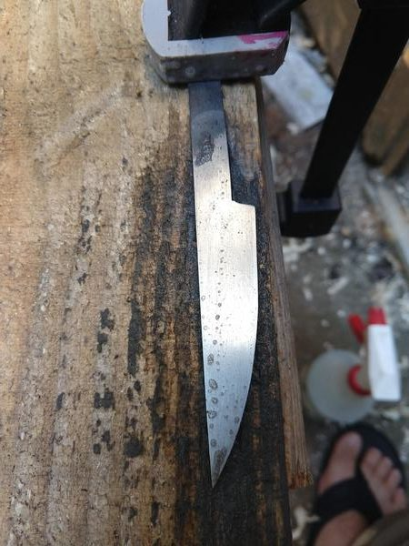
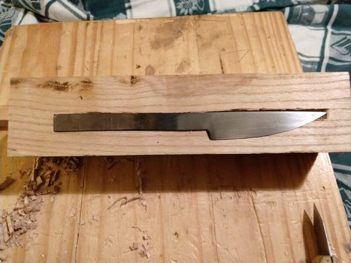

The other day I finally figured out how to sharpen my hook knife and so I took a shot at making a spoon.

In the end it turned out a little bit leaky.

In this process I realized that I needed a decent carving knife for the outside. So that's what I made.

First I used my jigsaw with a metal cutting blade to rough out the blanks.

 A boquet of blanks

Then I ground the profile and bevel on a belt sander clamped down to a workbench. After sanding to 120 grit I hardened it.

Yesterday I tempered it in the oven at 400F. Theoretically this should put the hardness around 62-63 RC for 1095 steel, but I have not confirmed this.

After tempering I looked closely and saw something funny.

I don't know if you can see it, but there is a wavy line at the tip of the blade that looks like it extends down the edge. This is most likely a [hamon](https://en.wikipedia.org/wiki/Hamon_(swordsmithing)).

Now this is hilarious to me. It generally takes a bit of work to put a hamon on a knife, but here it appears that I created one by accident. I hardened this with a mapp torch and a pile of firebrick. I didn't feel like pulling out the 2 torches I use to evenly heat bigger blades, so I ended up heating the edge to a higher temperature than the spine. So when I quenched it there was some differential hardening, resulting in this hamon.

Next I sanded the blade.

I started on a handle/case combo. I'll fit it all at once and then saw it in half to separate the case from the handle.

I will probably sand and polish this some more before etching in ferric chloride to bring out the hamon.

This is going to be the most pretentious carving knife ever.

[Part 2](/2018/07/the-carving-knife-part-2/)
