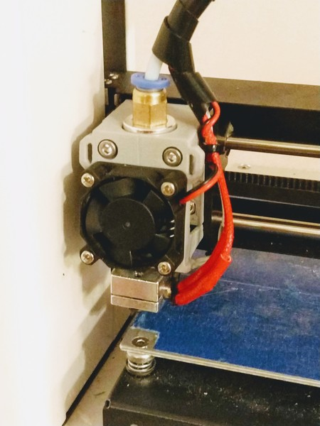
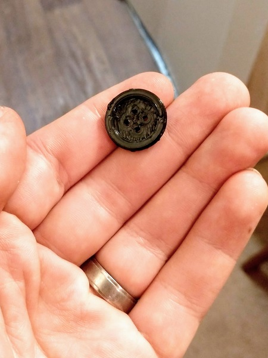

Let's get this out of the way: 3D printers are awesome. I have had mine for about a year and a half and it has let me build fun and crazy things like my [homemade keyboard](/2018/04/diy-mechanical-keyboard/).

But 3d printers are obnoxiously slow. It makes sense; it's the world's tiniest glue gun putting down layer after layer of molten plastic in order to slowly build up the missing part to fix a priceless gadget. Or a pokemon model. Whatever. It takes a while.

Not anymore.

I just installed a new hotend on my 3D printer. Yesterday I got a box of M3 screws and nuts. This was the last piece of the puzzle. I spent some time doing open-heart-surgery on my printer and in the end swapped out the stock hotend for an E3D clone.

I installed the 0.8 mm nozzle--twice as large as the stock nozzle that comes with my printer. This means that I won't have the same level of detail but I can quite possibly print twice as fast.

Sure enough, this shirt button took about 4 minutes.

This is magical.

Does anyone need a shirt button?
