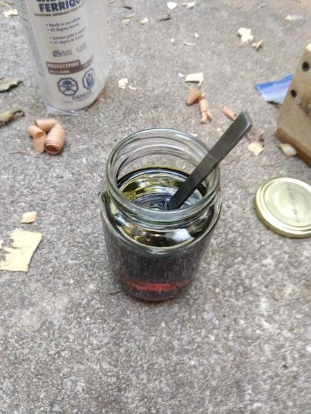
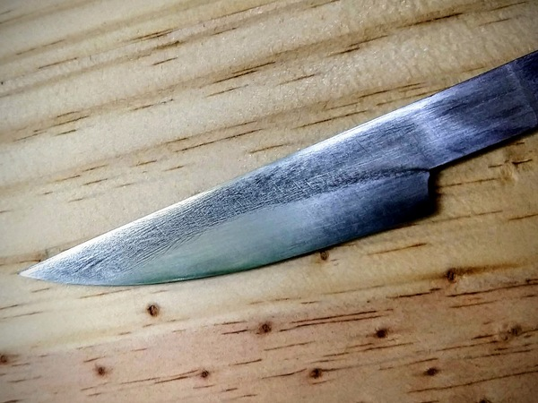
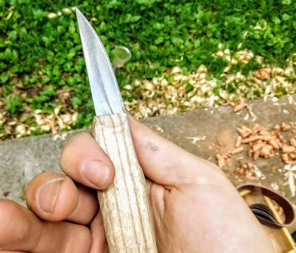

In my previous post about my work on the [carving knife](/2018/07/a-pretentious-carving-knife/) I mentioned that I thought I had stumbled into a differential heat treat. But I wasn't sure until I actually etched the blade.

Well my ferric chloride arrived the other day.

It comes with all kinds of fun tidbits on the bottle, like "caustic" and "poison." I diluted it 1:1 with water and stuck the knife in.

After about half an hour I took it out and abraded the surface with fine sandpaper. Here's what I saw:

Pretty, right?

I expected more waving in the line between hard and soft, but I didn't have any idea that the grain of the cold rolled annealed (CRA) steel would show up like it did. It turns out that CRA 1095 is already poor-man's Damascus. Who knew?

I put it into its handle and sharpened it up.

I like how the grain of the metal and the grain of the wood almost line up.

I expect some more etching in my future, whether I do differential heat treatments or not. It adds that bit of texture and interest that I'd be missing otherwise.

Thanks for reading.

[Part 1](/2018/07/a-pretentious-carving-knife/)
