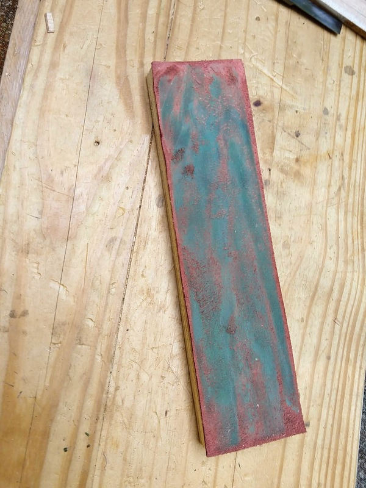

Here's a tool I've been meaning to make since I started woodworking. Now that I have it I'm kicking myself for not making it earlier. It would have made all of my other work more fun.

What is it? The humble strop.

Basically it is the final sharpening stone. This particularly fine example is a bit of 3/4 in plywood with a thin piece of leather glued to the face. This is drawn upon with green buffing compound. (Some people call that "charging" with compound but because the abrasive literally comes as a big green wax crayon, I'll call it drawing.)

I have been sharpening for years and have learned to consistently and quickly put an edge on most tools. But when I first took my pocket knife to the strop I was amazed. An already sharp knife became a razor.

Add this magic to chisels, plane blades, hook knives, sloyd knives--heck, _kitchen_ knives--and your making experience becomes significantly more delightful.

So don't wait; get a strop. Or build a strop. Or rub green abrasive compound on your nearest 2x4 and use that. It's really quite magical.

Thanks for reading.
