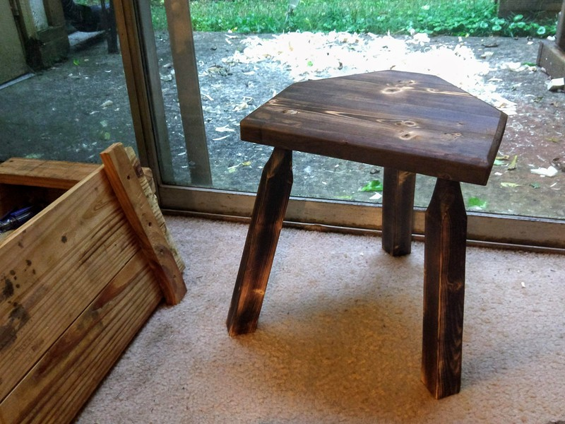
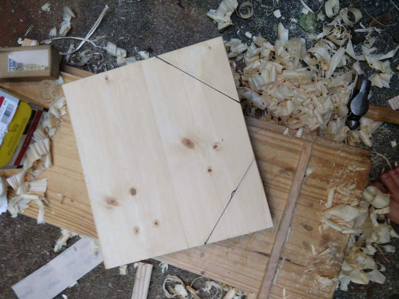
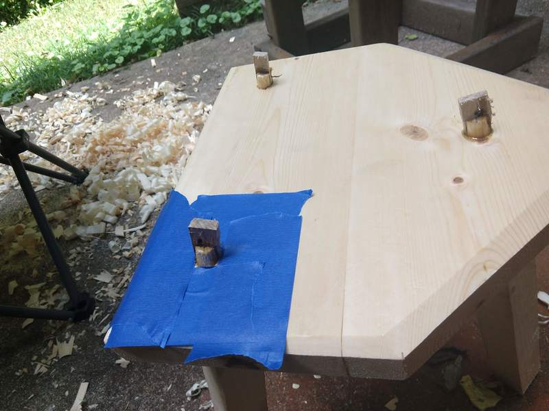
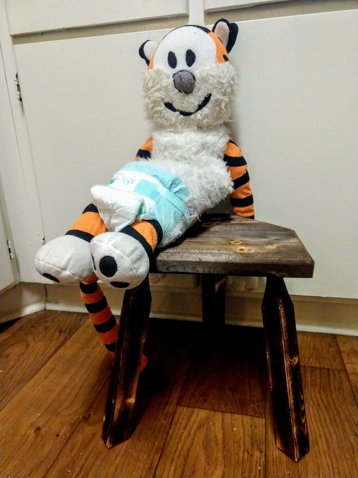

As I was building the small Welsh stick chair there was a time when the undercarriage was finished but the top wasn't attached. Wouldn't you know it, we sat on that thing all the time. We put coffee mugs on it; we set laptops on it; we used it as an end table wherever we happen to be hanging out.

Well the little chair now has a back (though I still need to permanently attach it with glue) so I decided it was a good idea to build a little stool.

I used home center 2x6 glued up to form a seat. I went with a simple semi-octagonal back. This is the shape I put on the tall stool I use with my standing desk.

Everything else was like a chair:

- Mark leg locations
- Drill and ream angles. I just eyeballed one front and the back, then used a bevel gauge to get both front legs to match
- Make legs. I got to use my new drawknife to shape the tapered tenons and it sure makes my hatchetwork seem sloppy.
- Fit legs
- Make wedges
- Glue and wedge legs
- Saw off tops of tenons
- Finish with FIRE

This was a fun, easy project that will probably get daily use until the pine seat cracks. What more could I want?

Hobbes approves too.
