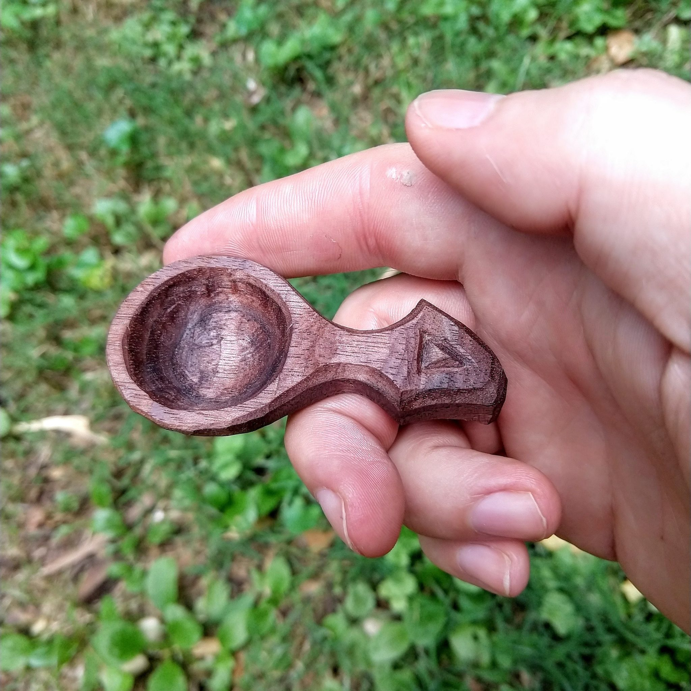
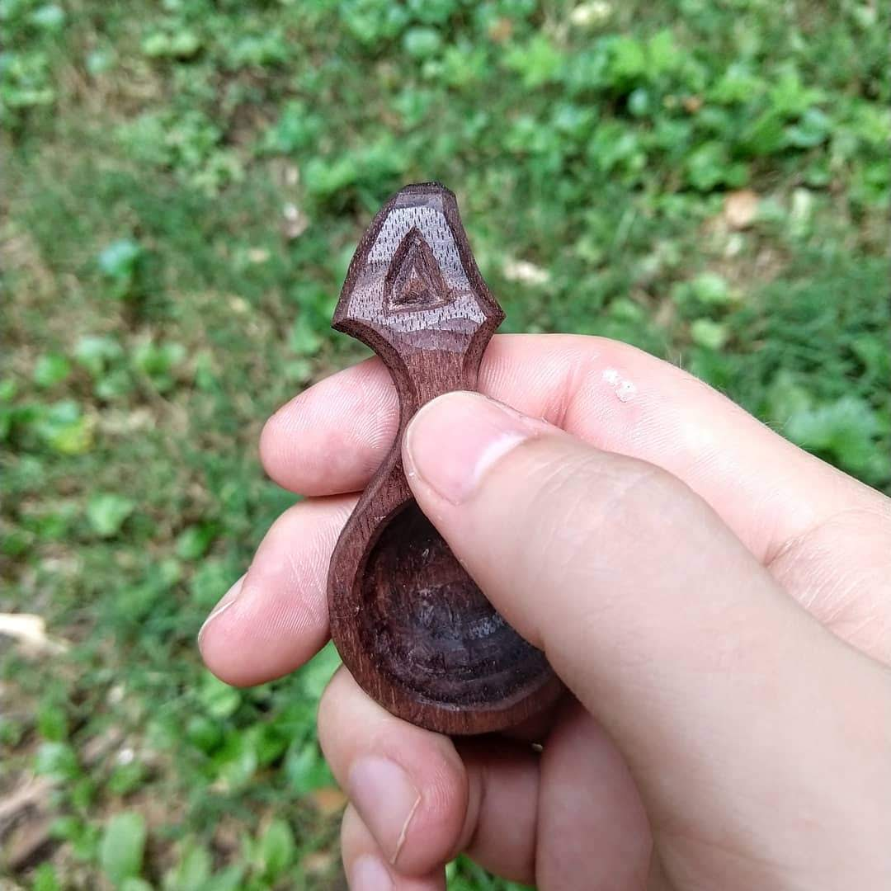

I've started making spoons recently. This is one of my most recent: a little walnut coffee scoop.

I carved this with a hatchet and 2 knives: [my homemade carving knife](/2018/07/the-carving-knife-part-2/) and a morakniv hook knife. The process goes like this:

- Draw shape
- Use hook knife to hollow bowl
- Use axe to cut away everything that is not spoon
- Use carving knife to cut whatever axe missed
- Carve Dr Seuss inspired design
- Make coffee

This ended up holding about 1 tsp. For me that means that 2 scoops makes a cup of coffee in the Aeropress. I've been using it for about a week and am well-caffeinated. Clearly this scoop was a success.
