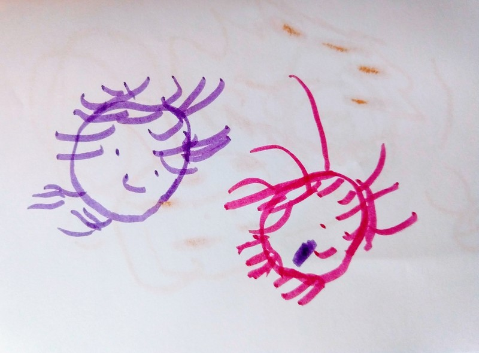

Perhaps one of the things I miss most from childhood is the deep-seated belief that everything can be fixed.

This picture shows two girls, drawn by the 3-year-old. She tells me that **the one on the right has been bitten by a crocodile.**

According to the story, the girl went into the crocodile's ocean and he bit her. But do not fear; don't you see the band-aid? She is okay.

I just know _I_ wouldn't be smiling like that if I were bitten by a crocodile . . . .
