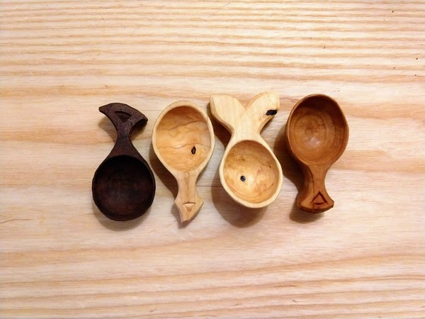

I have enjoyed making coffee scoops lately. These are short and sweet compared to many of my projects. They have a beginning, middle, and end without much extra anywhere. In short, they are fun.

Left is walnut, the roundest of the scoops.

The middle two are hawthorn that my dad cut from the woods in upstate NY. One is a bit fishy; the other bears a Dr Seuss finial.

The right is cherry, also from NY.

Thanks for reading.
