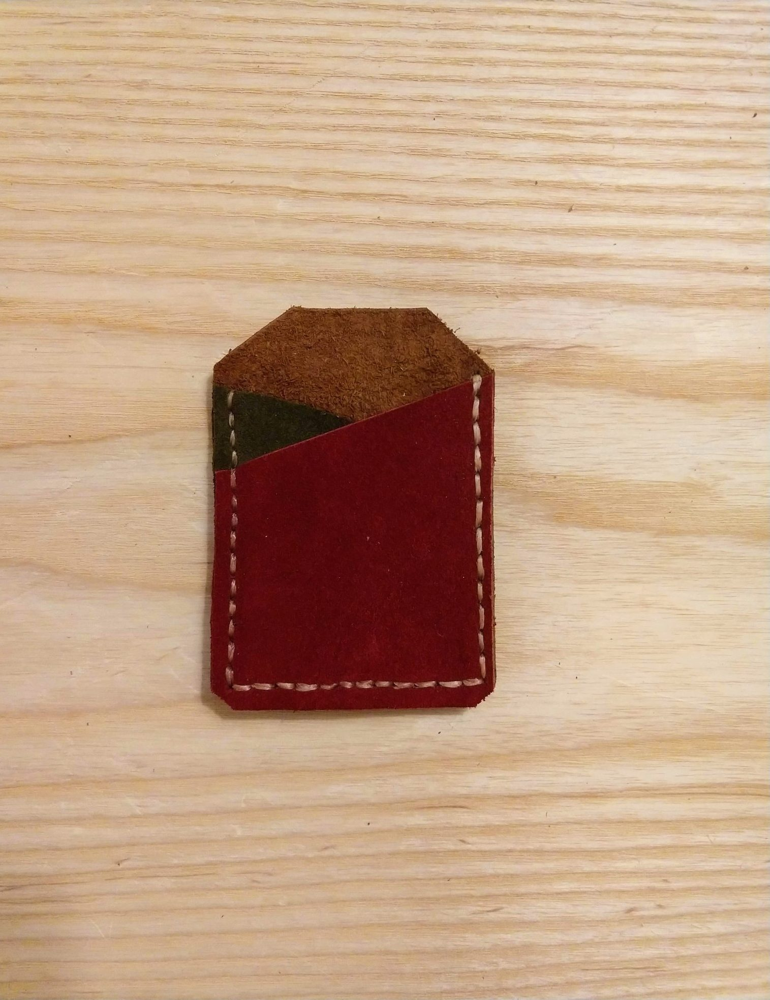

I finally finished setting up my [shop](/shop/) last night and posted the wallets I have been making recently.

Let me talk about my goals with selling things here:

1\. **I want to fund future projects.** I spend a lot of my discretionary money on tools and supplies so that I can realize a vision. That gets expensive quickly. If I can sell my projects, I can afford to make more. 2. **I want to share my work.** I make a lot of things as a matter of course, but to me a project isn't complete until it goes out into the world. By selling things on a webstore, I can expand my potential reach. Instead of limiting my work to family and friends, this enables anyone to enjoy my work. 3. **I want to experiment with small business.** I have always thought I'd like to start my own business. I may try to go full time on something eventually, but for now I'm happy to build a side hustle, inspired by [Nick Loper's work](https://www.sidehustlenation.com/).

Thanks for reading!
