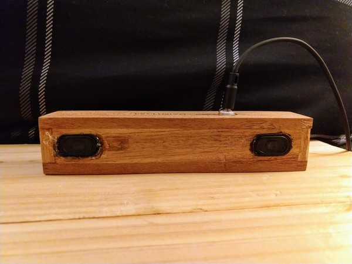
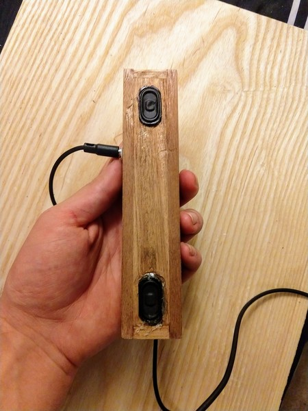

Today I opened a package that I had forgotten that I had ordered. It was a $0.76 mini chip amp from China.

I wanted to test it, so I searched to see if I had any free drivers. Lo and behold I had a busted laptop from my brother's college days. A few minutes with the diagonal cutters and I had salvaged some super tiny speaker drivers.

I hooked everything up together with a 9v and was soon blaring sweet, sweet tunes.

Then I looked for a box.

I just so happened to have this single serve cigar box that barely fit everything into it. With some drilling, carving, and soldering I came away with this:

It's a tiny, tiny speaker.

Yes, it sounds pretty much like a laptop. But that is better (louder) than my phone, so I'll take it. And I am honestly pretty happy with the clarity of the amp. It's better than I expected. I'm probably going to order more, since there are many projects in this world that could use audio. Still available for under a dollar; affiliate link [here](https://rover.ebay.com/rover/1/711-53200-19255-0/1?icep_id=114&ipn=icep&toolid=20004&campid=5338300398&mpre=https%3A%2F%2Fwww.ebay.com%2Fsch%2Fi.html%3F_sacat%3D0%26_sop%3D15%26_nkw%3Dlm386%2Bamplifier%26rt%3Dnc%26LH_BIN%3D1).

While the amount of hot glue in this build definitely precludes the moniker of 'fine woodworking', I enjoyed myself thoroughly. And next time I'm on the patio carving spoons, I'll be able to play some music out of a speaker that didn't exist before today. That makes me happy.

Thanks for reading.
