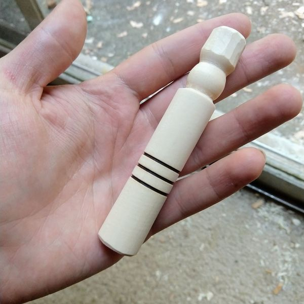
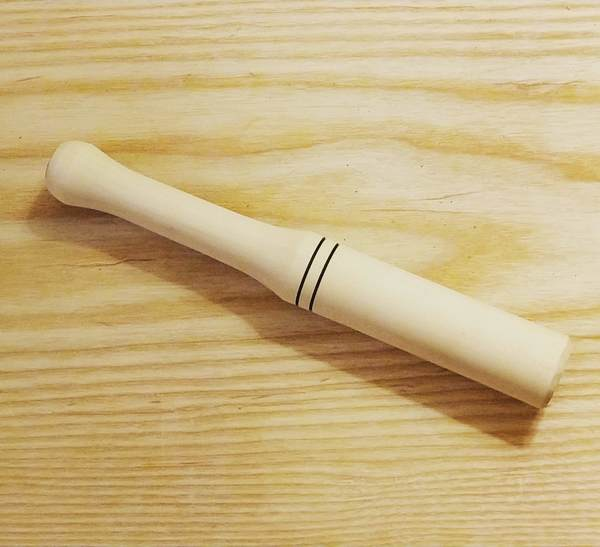
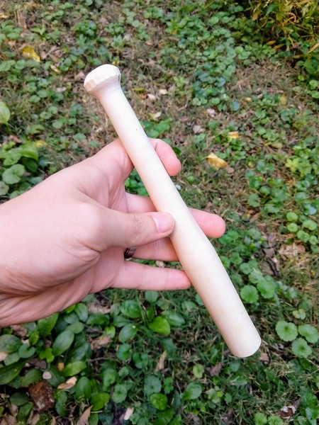
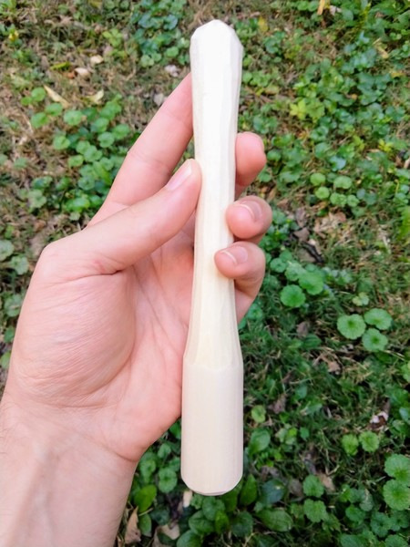
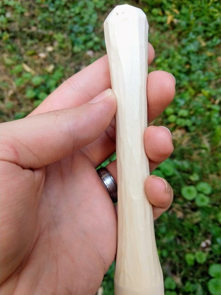
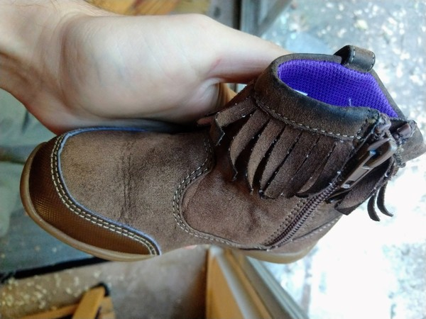

This is a mini muddler: for making short drinks.

What is a muddler? A bartender's tool for crushing leaves and berries so the juices can escape into your glass.

Big brother muddler: for muddling or beating up intruders.

Baseball bat muddler, for home runs.

Carved muddler for hipsters,

Or anyone who likes facets.

Emergency muddler

For when you NEED a mint julep.

Some of these will be for sale. Others belong to my 3-year old . . . .

Thanks for reading.
