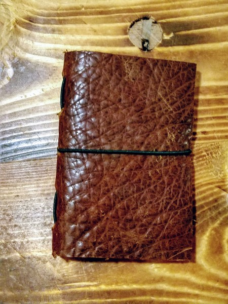
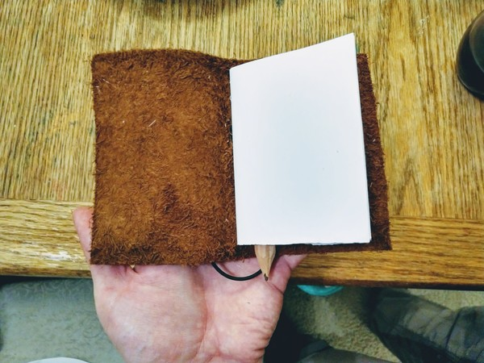

I recently made my first traveler's notebook. These are sometimes called 'midori notebooks' but I think that's a trademarked name.

The main component here is the leather cover. The idea is that you create a leather wrap with elastic cord, so you can add and replace individual signatures.

This one is made of bison leather and is meant for pocket notes. The signature is 64 pages (32 sheets) which I stapled and then cut down to make it pocket-sized.

This is easy to make and fun to use.

## The materials - Leather (this one is about 6"x4", which folds into 3"x4") - 2mm elastic, I bought mine on ebay: [here](https://rover.ebay.com/rover/1/711-53200-19255-0/1?icep_id=114&ipn=icep&toolid=20004&campid=5338300398&mpre=https%3A%2F%2Fwww.ebay.com%2Fitm%2F2-mm-ELASTIC-CORD-BLACK-NAVY-ROYAL-BLUE-TURQ-GREEN-GRAY-KHAKI-2-5-10-20-YARDS%2F132781649268%3FssPageName%3DSTRK%253AMEBIDX%253AIT%26var%3D432088463486%26_trksid%3Dp2057872.m2749.l2649) (Note: this is an affiliate link. If you purchase via this link, I may earn a commission.) - 8 sheets of copy paper

## Making it

I started by cutting my leather into a square. I said it was 6"x4", but really it was the biggest rectangle I could cut out of scrap I had on hand. I do this using a straightedge and my homemade folding kiridashi.

Then I folded paper into quarters and trimmed it to fit my leather. I stapled this signature but will most likely stitch the next one--my stapler is a bit of a wimp.

Then I folded the leather in half and marked out 5 holes on the spine. I eyeballed this, but you can measure if you prefer. I used a shop made stitching awl to poke the holes all the way through.

I then pulled the elastic through the middle hole into a loop large enough to go over the notebook when closed. I followed by pulling the elastic out through the next hole and then back to the inside at the ends. I placed the leather booklet in the middle and tied the free ends of the elastic around the middle.

That's it; it's finished. depending on how many pages you want you can tie another loop of elastic to slip around the first booklet and add a second. Or you can add two more. Because this one is meant to be pocket-sized, I am sticking with one signature.

Thanks for reading.
