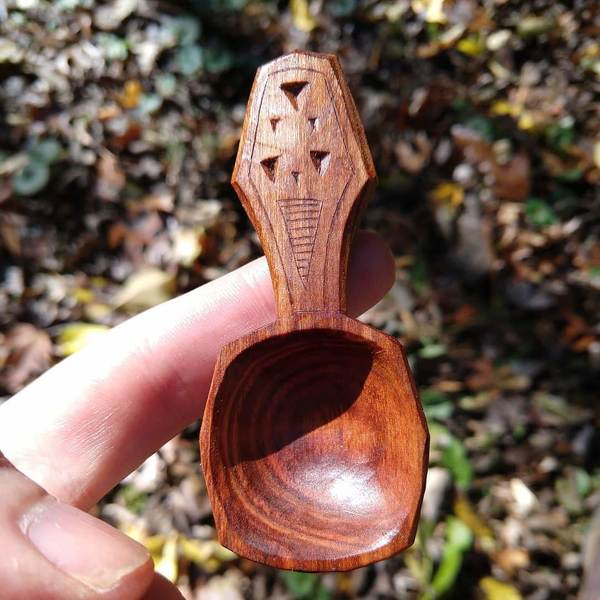
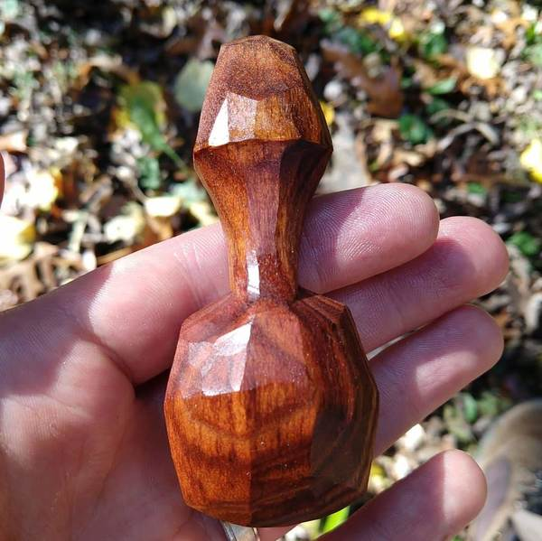

We live in a world of stainless steel spoons. They are perfectly stamped, easy to clean, and easy to use. Like any good tool you forget your spoon in favor of your soup (or ice cream, if you prefer).

So why am I carving spoons?

 A coffee scoop in cherry

Here's the thing, most of the spoons in the world are the same. There are variations between brands, but they are all stamped from the same stuff. They are perfect, and they are boring.

 This scoop is NOT perfect

So that's one reason to make spoons: **life doesn't have to be boring**.

When you use a hand carved spoon or scoop, it's like finding a park in a city. It's a bit of green space among the concrete. Our lives are full of things that are efficient and useful. This is a good, but it's not enough.

We need imperfection, unique artifacts that surprise us. Encountering a human-crafted object is like running into a friend in an unexpected place. It's a delightful reminder that we are humans, not machines. It's a reminder to slow down and enjoy the coffee.

That's why I carve spoons.

What are your favorite human-crafted artifacts?
