I built a one handed keyboard last year and it got me hooked.

This week I finished my third keyboard build:

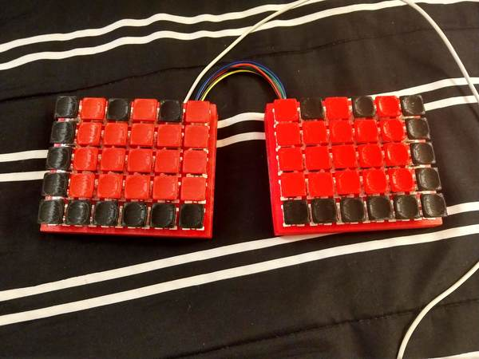

I've been using may handmade split planck for a while now, and I love it. It is fast and efficient and a joy to use. However, it is not awesome for games. The lack of number keys makes certain things very difficult.

So I modified my CAD and added another row.

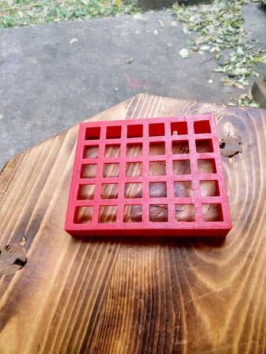

Then I snapped the keys in.

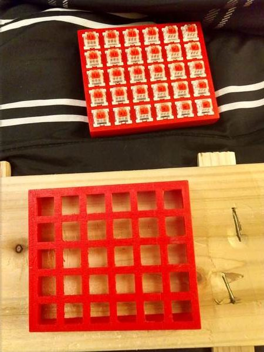

After both halves were ready to go, I flipped them over and soldered on the diodes, left to right, along the rows.

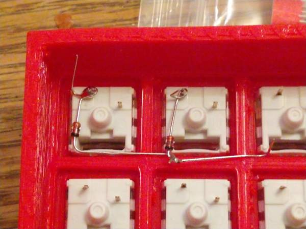

I continued until there was a diode per key.

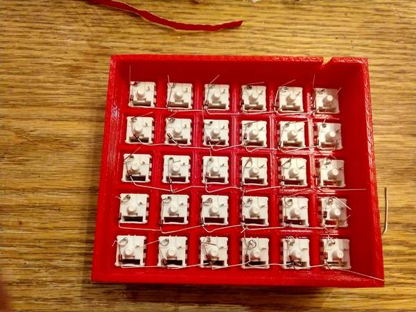

After soldering all the diodes I moved to the rows. I stripped the wire at the end and then several places in the middle so I could use one wire per column.

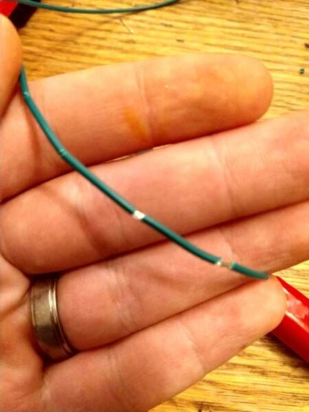

I added a wire per row, going along like this.

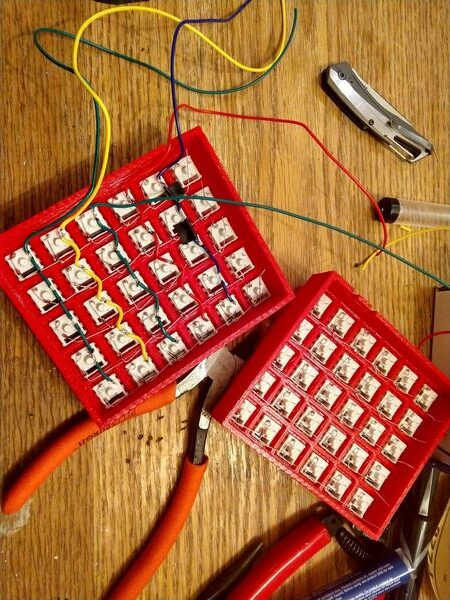

Eventually, I had all of the columns wired, so I added some extra wires (black) to connect all the wires on one half of the board over to the other. I added zip ties and routed all of the wires over to the left hand (this side is where the microcontroller will sit).

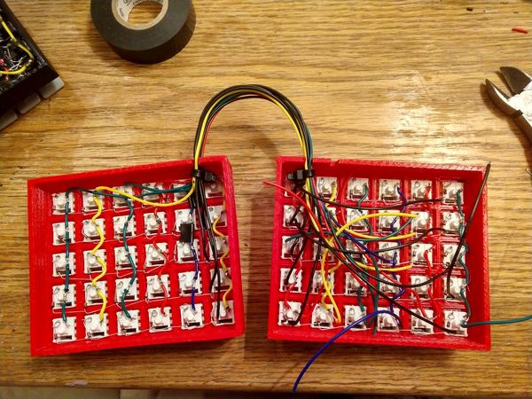

This was a milestone to celebrate.

I then consulted a printout of the arduino pro micro pins so I knew where to solder things. Then it was time to wire all of the keys to the microcontroller.

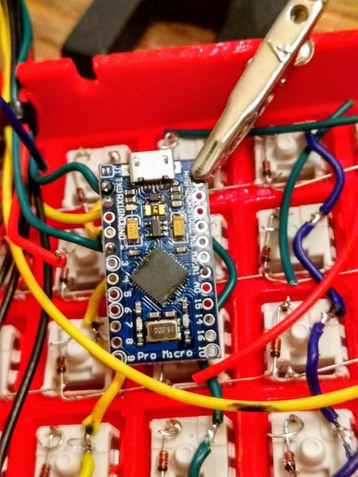

I was halfway through when I realized that I had skipped a pin in my soldering. I had to go back to my plan and make a note so that I could correctly generate the firmware. Eventually I finished soldering all of the pins and it looked like this.

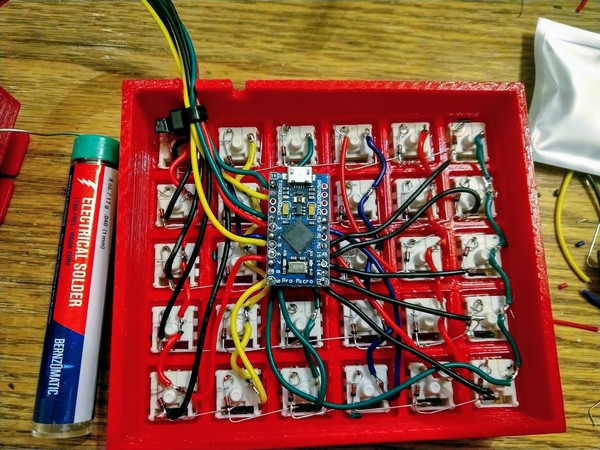 Electric spaghetti

I generated the QMK firmware using some online tools: - [Keyboard layout editor](http://www.keyboard-layout-editor.com/) - [Keyboard firmware generator](http://kbfirmware.com/)

Once I had the firmware setup with the keymap and pins I was using, I exported the .hex file and flashed it to the arduino:

\`sudo avrdude -p atmega32u4 -P /dev/ttyACM0 -c avr109 -U flash:w:lmpreonic.hex\`

Amazingly, it worked on the first try. I did need to go back to my layout and swap the windows and the alt key (they were driving me crazy). But nothing was missing and nothing needed to be resoldered.

After a bunch of cad and 3d printing, I added the keycaps to complete the build.

And here it is in its natural habitat.

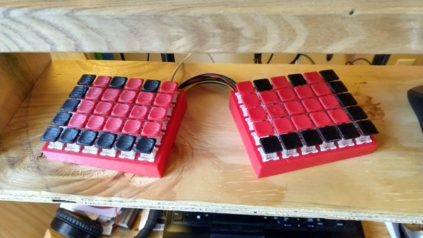

I typed this entire post on the new keyboard, so I can say it has been a success.

If I get enough interest I may write a follow-up post with the technical instructions and source files. Let me know if that would be helpful.

Thanks for reading.
