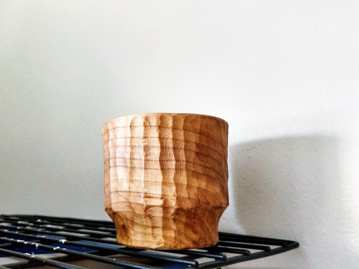
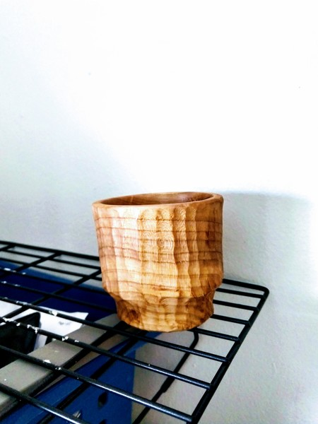

Last night I wanted to make knives, but my belt sander is too loud.

Instead I made this.

It is a turned and carved cup in pincherry. This is my second cup ever and I must say it turned out better than the last one.

An important focus for me here was to make the walls a consistent thickness. I could definitely do better in the bottom, but I'm happy with the side walls.

Then, since I didn't want to spend my night sanding, I carved the outside and the bottom using my [spoon carving hook knife](https://amzn.to/2SozZdg) (affiliate link*). It worked really well.

Since starting spoon carving, my mindset towards the wood has changed. It's not that big of a deal to carve it anymore. In the past I would have tried to figure out how to flip the bowl on the lathe and turn it there (which means I need to make a jam chuck). Instead, I rough turned it on the lathe and then finished it with carving knives. It is probably a bit slower, but it's a nice process.

And the texture--I love ripples and ridges over plain, smooth walls.

I oiled it with [food grade tung oil](https://amzn.to/2zI37VV)*. When it has dried and hardened, I'm planning to drink coffee or bourbon. Time will tell.

Thanks for reading.

*Notes about affiliate links over at [my about page](/about/)
