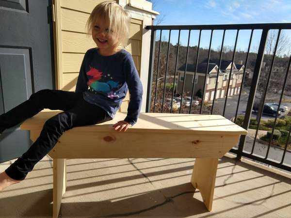
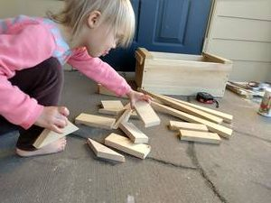
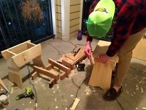

I visited my brother over the break. He, having recently moved, had only 2 chairs. So while the girls went out on the town, we trekked to the Home Depot and bought enough white pine for some benches.

This is what the big bench looks like.

We started by measuring the chairs he already had. They were padded and came around 19 inches. So we designed most dimensions around an 18-inch unit, allowing the thickness of the seat to bring us up to 19.

Since he already had 2 chairs, we decided to make 1 bench and 2 benchlets. The long bench would be 3-1/2 feet long, while the short ones would be 18 inches long. This meant we needed to buy 2 12-foot 1x12" pine boards.

We started by picking the best sections for bench tops, and then marking everything else out. We cut the top, the rails, and then 6 legs. We tapered the legs by 2" over the 18" length (that's 1:9 if you measure that sort of thing). This made a bunch of nice blocks.

We put the whole thing together with 8d nails. Yes, we made a bunch of hammer dents. No, I won't show you.

We chamfered the corners and they were ready to go.

Then we ate dinner around the table, the 5 of us each having something to sit on.

I'm still waiting for my brother to paint them for final photos, but there it is.

Thanks for reading.
