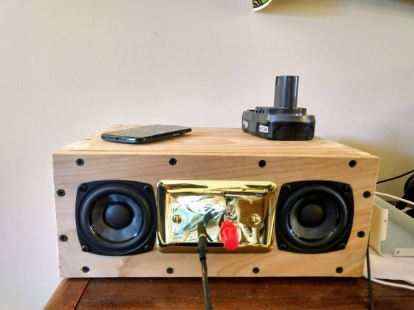
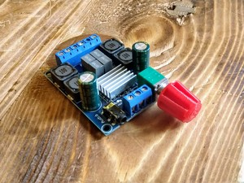

We've all seen (and heard) the battery bluetooth speakers. I wanted to make one that was still portable, but a bit more serious. Here's my drill-battery powered speaker.

It all started with the drill battery. It's just sitting there, high-powered and easy to recharge.

I found a [thingiverse file](https://www.thingiverse.com/thing:2417350) that fit my ryobi battery. I printed it out and added a battery clip.

Then I gathered parts - a [TPA3116 chip amp](https://rover.ebay.com/rover/1/711-53200-19255-0/1?ff3=4&toolid=11800&pub=5575388422&campid=5338300398&mpre=https%3A%2F%2Fwww.ebay.com%2Fsch%2Fi.html%3F_from%3DR40%26_trksid%3Dp2380057.m570.l1312.R1.TR11.TRC2.A0.H0.Xtpa.TRS1%26_nkw%3DTPA3116%26_sacat%3D0%26LH_BIN%3D1%26_sop%3D15%26LH_PrefLoc%3D3) *(affiliate link) - 3" full range drivers from [parts express](https://www.parts-express.com/dayton-audio-pc83-4-3-full-range-poly-cone-driver--295-154) - miscellaneous bits - panel jack - power jack - 3 way power switch (you don't want the battery and the wall power ever connected together) - a brass wall plate - wire - pan head screws - 3d printed bits - battery clip - bass reflex ports - [volume knob](https://www.thingiverse.com/thing:3378713)

 Fancy knob

I built a pine and cedar cabinet, dovetailing the corners. They aren't pretty, but they are strong and they were good practice. I cut out the holes with a jigsaw, then screwed on the face bits and soldered everything together. Finally I filled it with pillow insulation as my upcycled acoustic fill.

Then I took the battery out of the impact driver, stuck it in the speaker and pressed play.

It sounds great, it's portable, and it ran for 14 hours on one 1.3 amp-hour battery. Sounds like a winner to me!

Thanks for reading.
