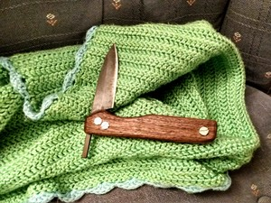
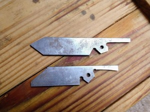
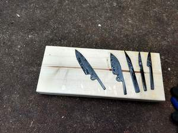
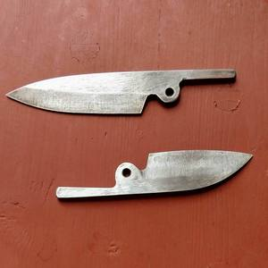
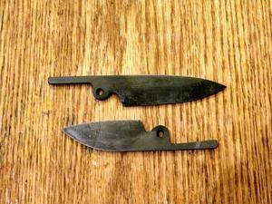
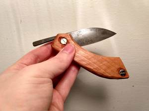
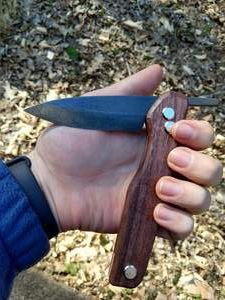
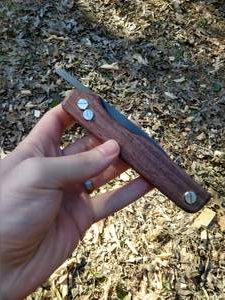

I recently finished the second of two friction folder knives that I've been working on.

They started as 1095 high-carbon steel blanks that I cut out with a jigsaw.

I ground them on a belt sander with ceramic belts, then heat treated them. Here's the batch right after hardening.

After hardening, I tempered them in the oven and cleaned them up with sandpaper.

Then I acid washed them in ferric chloride, darkening them to a nice grey.

I cut the handle scales out with handsaws, then carved them.

Here's the first knife, a Wharncliffe style blade with jatoba handles.

The next knife is much larger. I followed the same steps, cutting out handle blanks from walnut and then shaping them with my carving knife.

This one is a monster, though it still fits in your pocket--barely.

After using high carbon steel blades like this, I find myself a bit disappointed with my stainless steel pocket knives. They are very convenient, but they don't hold their edge like the carbon steel. Of course you do need to keep carbon steel clean, dry, and oiled. And I don't know how to make pocket clips yet.

What do you prefer?
