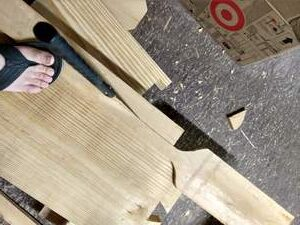
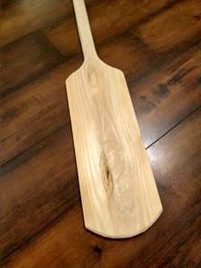
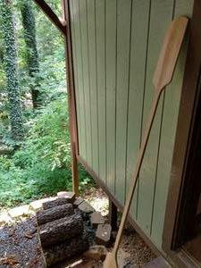

We recently moved to within a quarter mile of a public boat launch, so I ordered an inflatable kayak. I have to tested it yet, but I know that the 3-year old will want her own paddle.

I took a cedar fence picket and some round paint cans. I used the cans to mark some curves and cut them with the coping saw. I marked some straight lines and cut them with the ryoba.

I smoothed all corners with a hand plane and a carving knife. After a little bit of fine sanding on the handle, it was ready for finish.

This one may be a little too flexible for a strong paddler, but will be light enough for a kid. On my next one I will probably glue the offcuts back to the handle and then shape it round. It would add a day of glue drying and a little bit of extra time shaping, but would make it much stiffer.

That's it. This was a good project--fast, easy, and very satisfying.

Thanks for reading.
