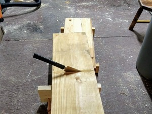
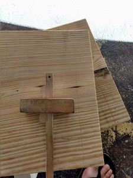
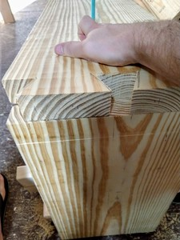
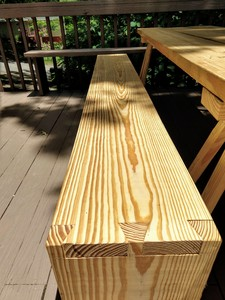
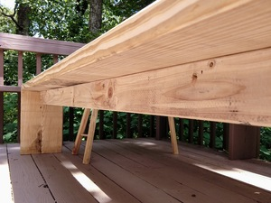
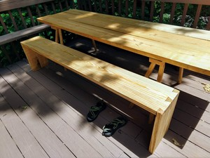

Since making an outdoor picnic table we have used it most clear evenings. On one side we have built-in benches that are part of the deck. On the other side we have been using camping chairs. But these are really uncomfortable--much too low.

So last week I built a bench.

I started off with a 12 foot 2x12 in southern yellow pine. This stuff is great when you want solid construction furniture. It's dense and _heavy_.

I started by measuring 19 inches from either end, since that's how tall I wanted the bench. I sawed that bit off each end and then marked a baseline for dovetails.

After this I drew the tails and sawed them out. I used the ryoba and a coping saw. One nice thing about massive dovetails like this is that it's easy to get in between the tails. So I did whatever trimming needed to happen with my carving knife. It was pretty fast.

I tried to do a dry fit and realized 2 things:

1\. Because SYP compresses a little I wanted these to be very tight 2. My 16 oz hammer is nowhere near big enough

So I bought a 3 pound drilling hammer (or 'engineer hammer') and hammered them home. The fits are good, but there are a few gaps. That's okay with me; these dovetails are mainly for structure and less about beauty (we are using SYP after all).

The bench is solid enough as is, but to prevent sagging and racking I added a brace underneath. This is just a 2x4 with freehand pocket holes on the ends and down the length.

There it is. Now we can sit high enough to comfortably use the table.

Thanks for reading.
