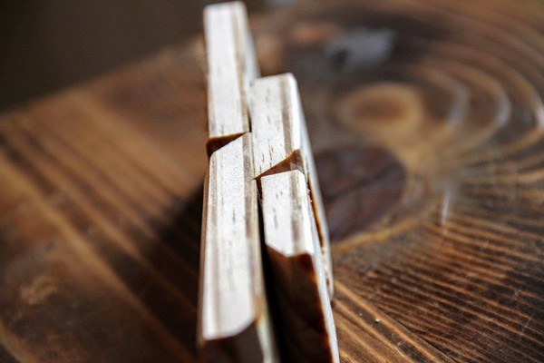
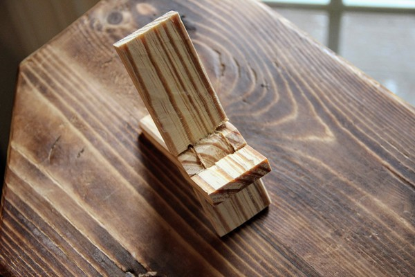
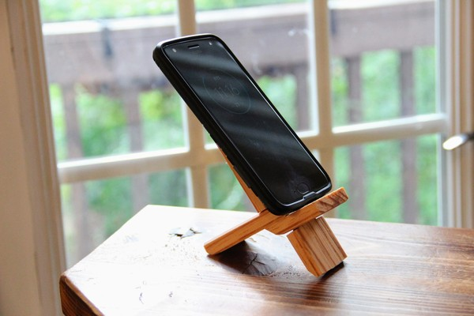

I recently got a small bandsaw. Every new tool offers new and different opportunities. The bandsaw is great for ripping boards--something that is not fun by hand. So last night I went to the shop and built a Roubo-style phone stand.

This comes from the designs of [Roubo](https://en.wikipedia.org/wiki/Andr%C3%A9_Jacob_Roubo), an 18th century woodworker and writer. This particular bookstand was popularized by Roy Underhill (video [here](https://www.pbs.org/video/the-roubo-bookstand-svk8o6/)).

The idea is that you saw it out of one board, cutting the integral hinge right into the wood. This is fun because it's a bit like a puzzle as it moves and folds. "How do you put that together?" is an impossible question. Instead, the answer is "How would you cut it apart?"

Now that I've tried this in yellow pine I'm excited to try with some nicer wood. Cherry or walnut, here we come.

Thanks for reading.
