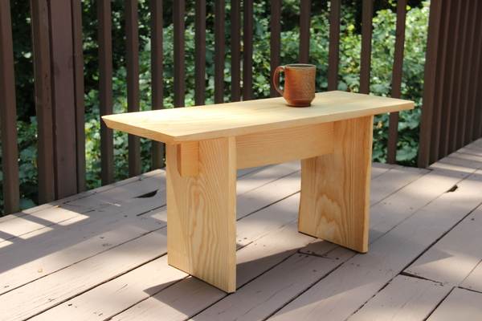
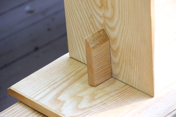
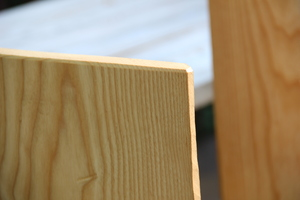

We've been in the new house since May. Slowly I am completing projects to make it more like home.

I recently completed this coffee table.

I wanted to build something simple with traditional joinery. I wanted something we could appreciate or ignore. I wanted something with details that I would enjoy whenever I saw it. But I settled on this.

I started with an [white-ash](https://m.xkcd.com/37/) board from my dad in Upstate NY. Since [ash trees are dying all over the country](https://en.wikipedia.org/wiki/Emerald_ash_borer#Environmental_and_economic_impacts) this is a good way to preserve this beautiful wood. One of the best parts of the new house is space for more tools. I bought a power planer and was able to save myself hours of hand planing--what a game changer!

The legs are joined with a half-lap brace. (Or is it a cross-lap if it joins on edge? I can never remember).

The top sits on dowels in the end of the legs. This means that it currently can break down and put away. This feature was a knee-jerk reflex of our last move. I suppose I won't be moving it again soon, but I couldn't help it.

I added chamfers around all edges and then a few coats of tung oil.

This is not the most durable finish, but it will be easy to fix when (not if) it gets spilled on, drawn on, and otherwise enjoyed by small children.

I hope the ash species survives, but at least this piece will be preserved.

Thanks for reading.
