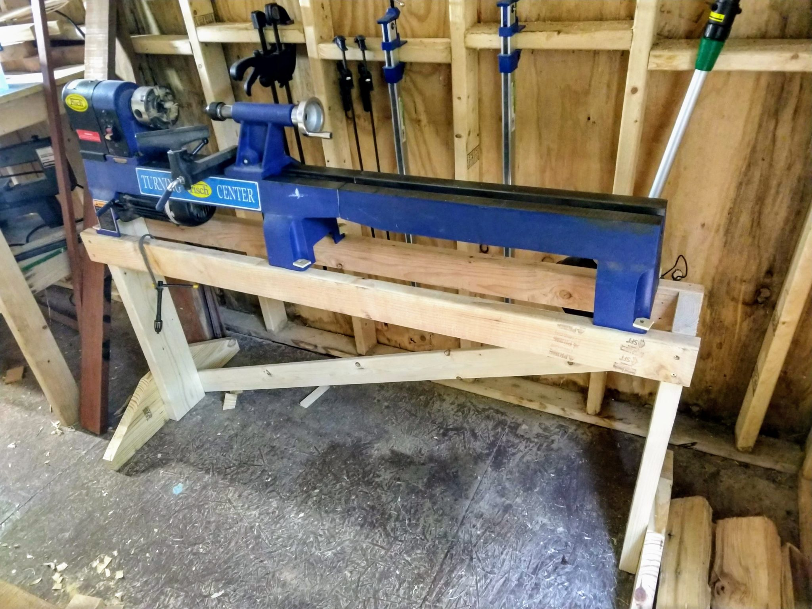

One of the benefits of the new house is my little workshop. I used to carry the lathe in and out to the back patio anytime I wanted to turn a pen or a muddler. That also meant that I never used the bed extension.

Today I finally built a lathe stand.

It's quite simple with a 2x6 at each end, 2x4 rails, and then feet screwed onto the ends. You can also see a long stringer to keep it stable.

So far everything is working well. I just have to find my drive center and I'll finally be able to try turning longer spindles!
