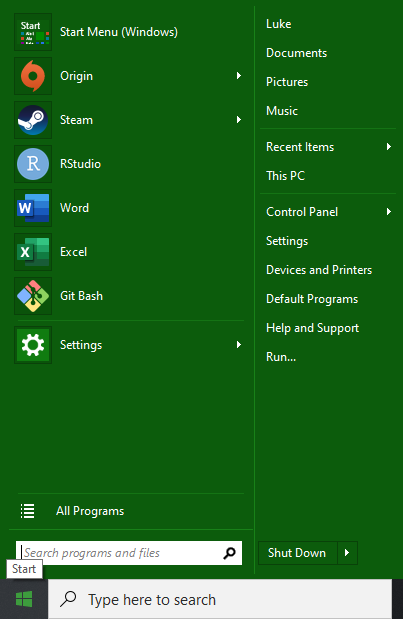

I am a linux guy. Since Windows Vista, I've found that I prefer the simplicity and predictability of open source software to the arbitrary (and silly) business decisions that Microsoft keeps foisting on its users. However, I also run Windows in order to use Excel and for games. I have come to peace with it--mostly.

With the most recent Windows 10 update, Microsoft removed the ability to turn off Bing search in the start menu. That means when you press start and start typing, it no longer searches just your programs and files. It also searches for web results.

There are a lot of problems with this.

1\. Speed - It takes longer to search the web than it does to search local files/folders. 2. Distraction - If I am typing into the search it is because I am looking for something. I am never looking for Bing search results; they are just distracting 3. Privacy - I already have my phone searches going to google; I have no reason to send my data to Microsoft as well.

I tried several fixes, eventually discovering [a How-To Geek article](https://www.howtogeek.com/224159/how-to-disable-bing-in-the-windows-10-start-menu/). I tried their recommended registry edit solution to disable bing search, but it actually disabled _all_ search.

I thought I was stuck, but then I remembered that years ago (during Windows 8 full-screen start menu days) I discovered a start menu replacement. A little google-fu later and I rediscovered [Open-Shell](https://github.com/Open-Shell/Open-Shell-Menu). This is a simple, lightweight drop-in start menu replacement.

Does this look familiar? It did to me. It returns to the best parts of the older Windows menu setups, like in XP and Windows 7. It is:

1\. Simple 2. Clean 3. Customizeable 4. Without a forced web search

If, like me, you are annoyed by the start menu web search, then you should give [Open-Shell](https://github.com/Open-Shell/Open-Shell-Menu) a try.

Thanks for reading.
