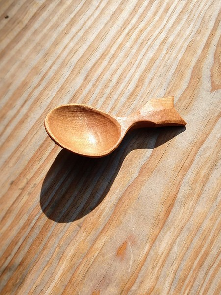
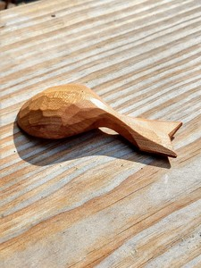

I've been making some coffee scoops recently and this is the one that I most enjoy.

It's cherry, like most of my spoons.

Scoops are in some ways more difficult to carve than a regular eating or serving spoon. First, they're difficult to hold on to. Bigger spoons have a handle. Second, they are deeper than other spoons which means that the angle of the hook knife is different.

I have cut myself more times making scoops than any other kind of spoon.

But they look beautiful and are fun to use.

Coffee, onward!
