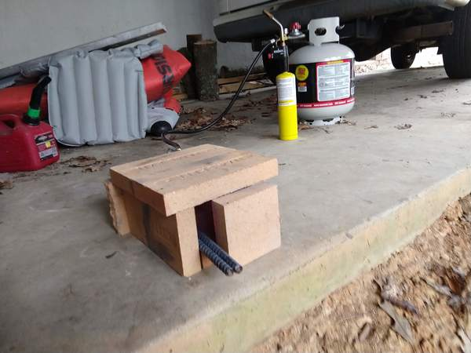
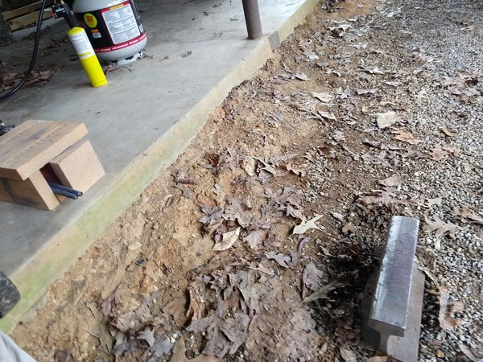
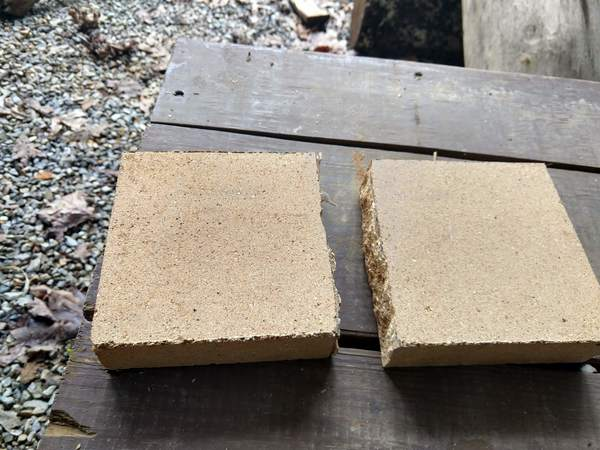
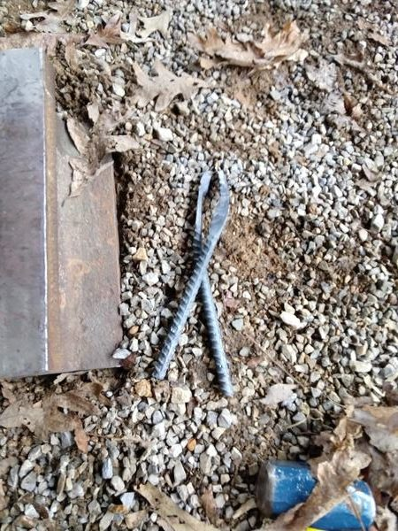
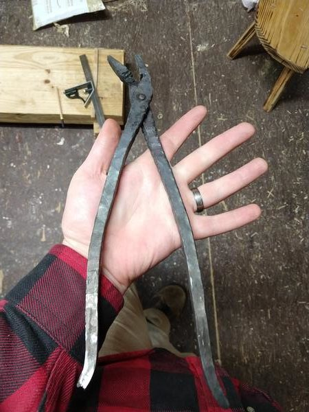
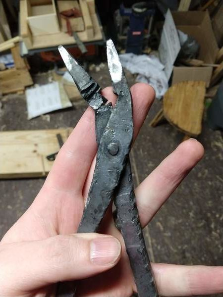
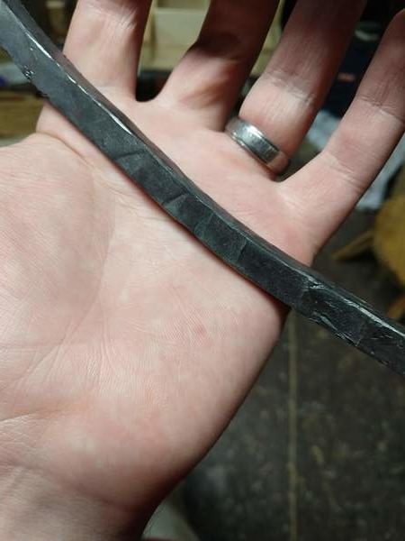

I have wanted to try blacksmithing since I was a kid. Yesterday I finally got a chance to do that.

My setup is a propane tank, 6 firebricks, and a piece of railroad track.

I had to cut one of the bricks. I scored it with the angle grinder and then snapped it over the edge of the anvil.

I'm pretty happy with how that turned out.

For my first project I _tried_ to make bladesmithing tongs. I hope to use this mini forge setup to make knives soon, so I wanted a pair of tongs.

Here's how they started:

Quite promising, for rebar.

Unfortunately here's how they ended:

Ugly? Yes. But that's not the problem.

I think I overheated the tip while I was making it, so the jaw itself snapped off when I tried to adjust everything to bend around the flat stock.

Still, it was a fun start and I got a try at making

- tapers
- curves
- rivets

So I am not thrilled that the project bombed, but I like that I can finally get metal hot enough to play with.

And doesn't that finish make you want to touch it?

It's very tactile and interesting. I enjoyed it immensely.

Thanks for reading!
