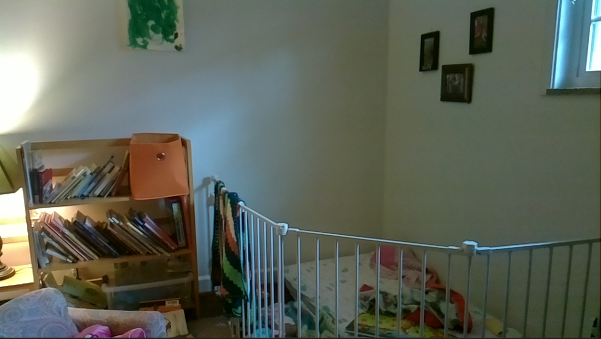
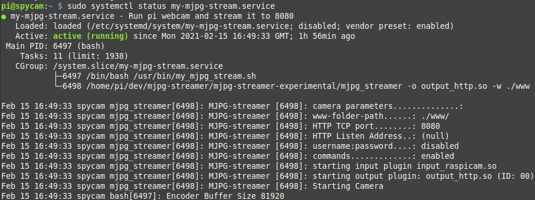

## Purpose

Audio baby monitors are cool and all, but how do you know when your 1-year old decides she's big enough to climb out of the crib?

Enter the baby spycam.

This project follows:

- [jacksonliam/mjpg-streamer](https://github.com/jacksonliam/mjpg-streamer) (github) - [start-service-at-boot](https://www.linode.com/docs/guides/start-service-at-boot/) (Linode)

## Download and build

Create a dev directory, clone the github link, and compile for install.

``` mkdir dev cd dev git clone https://github.com/jacksonliam/mjpg-streamer.git cd mjpg-streamer/mjpg-streamer-experimental/ make sudo make install ```

## Test interactively

Test it:

``` export LD_LIBRARY_PATH=. ./mjpg_streamer -o "output_http.so -w ./www" -i "input_raspicam.so -x 1280 -y 720 -fps 15" ```



It works!

## Create bash script

``` echo './mjpg_streamer -o "output_http.so -w ./www" -i "input_raspicam.so -x 1280 -y 720 -fps 15"' > my_mjpg_stream.sh chmod +x my_mjpg_stream.sh ./my_mjpg_stream.sh ```

It still works.

In the end I needed to modify this script slightly to include the library path, and to use absolute file paths.

Here's the complete file:

`my_mjpg_stream.sh`:

``` #!/bin/bash

export LD_LIBRARY_PATH=/home/pi/dev/mjpg-streamer/mjpg-streamer-experimental

/home/pi/dev/mjpg-streamer/mjpg-streamer-experimental/mjpg_streamer -o "output_http.so -w ./www" -i "input_raspicam.so -x 1280 -y 720 -fps 15"

```

## link to /usr/bin

``` cd /usr/bin sudo ln -s /home/pi/dev/mjpg-streamer/mjpg-streamer-experimental/my_mjpg_stream.sh my_mjpg_stream.sh ```

## Create service

``` vim /lib/systemd/system/my-mjpg-stream.service ```

In this file, we write:

``` [Unit] Description=Run pi webcam and stream it to 8080

[Service] Type=simple ExecStart=/bin/bash /usr/bin/my_mjpg_stream.sh

[Install] WantedBy=multi-user.target

```

This is the service file that will let us turn it into a daemon.

Copy it to the right place and set permissions:

``` sudo cp /lib/systemd/system/my-mjpg-stream.service /etc/systemd/system/my-mjpg-stream.service sudo chmod 644 /etc/systemd/system/my-mjpg-stream.service ```

Start the service:

``` sudo systemctl start my-mjpg-stream.serve sudo systemctl status my-mjpg-stream.service ```



## Done!
