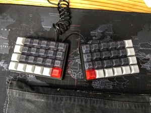
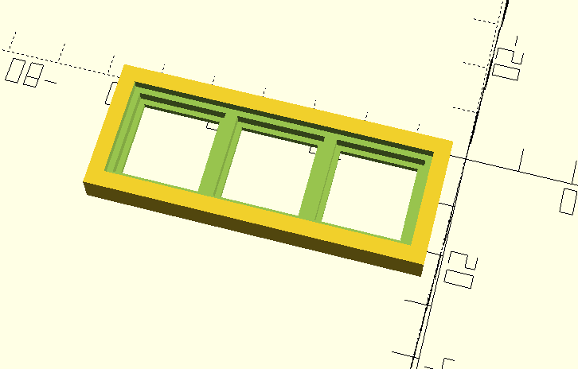
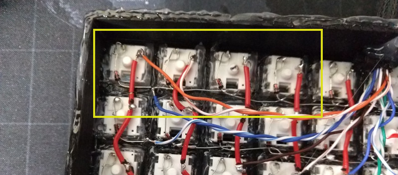
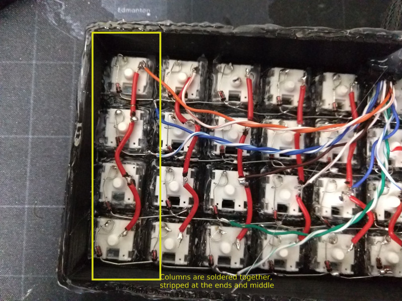
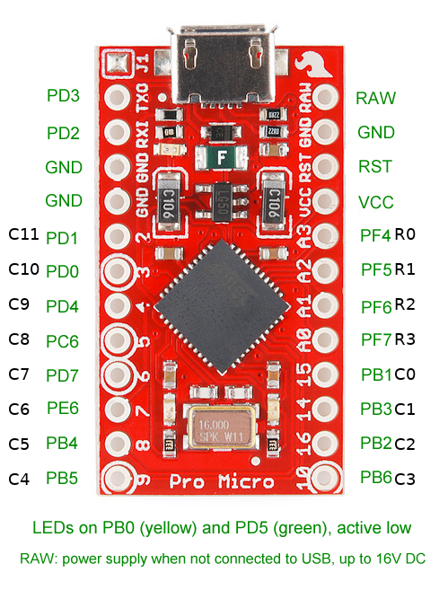
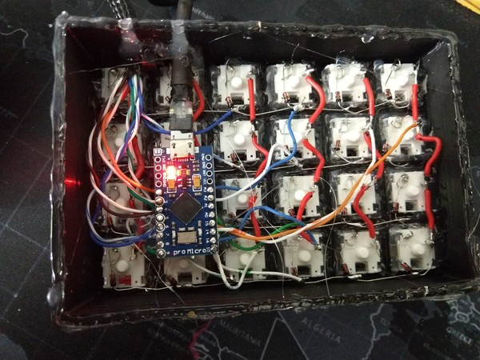
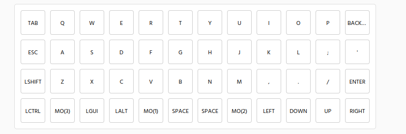
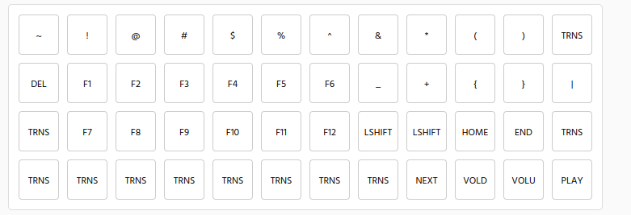
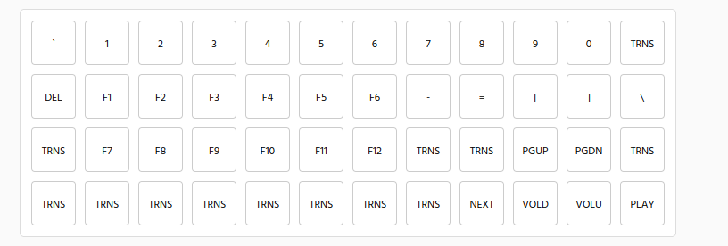
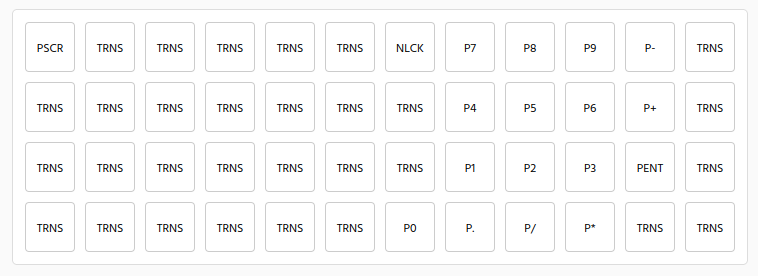

This is my favorite keyboard. It's comfortable, fast, and efficient. Make one!

## Materials

- 1 Arduino pro micro
- 1 nice micro usb cord
- 48 switches (your choice)
- 48 diodes (1N4148 or similar)
- 48 keycaps (I like DSA profile)
- 2 ft of old ethernet cable
- Some wire (18 AWG to 28 AWG is fine; copper is better)
- Paracord or cable wrap (some way to keep wires from RH to LH neat and nice)
- 3 zip ties
- Printed parts: 1 LH, 1 RH, test plate [CAD files](/wp-content/uploads/2021/10/split-planck-fillet.zip), [source](/wp-content/uploads/2021/10/kb-case.scad)
- Firmware: [split-planck-firmware](/wp-content/uploads/2021/10/split-planck-firmware.zip)

## Procedure

### Test switch fit

Print test plate and check switch fit.

The switches should snap in from the flat side (printer bed side). The fit should be snug: neither loose nor too tight to click in easily.

Adjust printer settings (better), or change the parameters in the scad file until you have a good fit (lose post-processed chamfers). I usually make it a little tight and trim with a knife later.

## Print LH & RH

When you have the right printer settings to fit the switch, print the RH and LH.

## Snap in switches

Make sure they are oriented the same direction.

## Solder diodes

This keyboard uses diodes to go across the rows. They should be oriented to go down and right:

## Solder columns

Cut a section of wire a little longer than the column, use a marker to mark where they need to be stripped, then strip a section in the middle. Solder the columns together.

## Solder RH & LH

The rows from the right hand need to carry over to the LH (where the microcontroller will live). Each row should have continuity aleng the bottom of the diode chain.

The columns also need to carry over from the RH to the LH.

## Solder microcontroller

The included firmware here expects this layout:

This is what it actually looks like:

The rows go to pins a3 - a0. Then the columns go the rest of the way around.

## Flash firmware

In the zip bundle, the .hex file is the kb firmware.

Command to flash from linux is:

\`\`\` sudo avrdude -p atmega32u4 -P /dev/ttyACM* -c avr109 -U flash:w:laptopplanck.hex \`\`\`

Get that ready to go, then reset the pro micro by bridging the 'RST' and 'GND' pins. Press enter and flash the firmware.

## Type

The base layer is this:

The next layer is accessed from the MO(1) key:

The next layer is accessed from the MO(2) key:

Finally, the numpad (and screenshot) layer, accessed from the MO(3) key:

Can re-arrange or remap at https://kbfirmware.com/ by uploading the \`laptopplanck.json\` file from within the firmware bundle.
