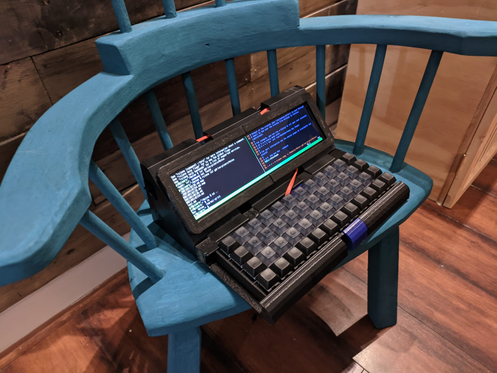
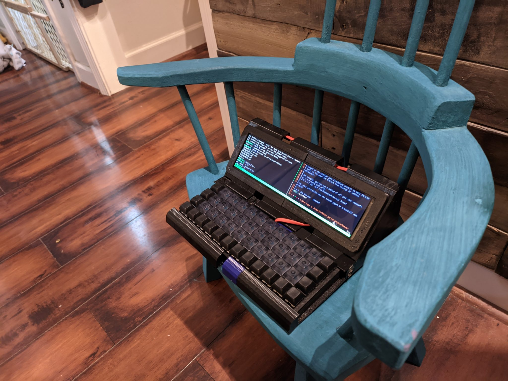

# A story about a raspberry pi laptop

Once upon a time I was excited about typewriters. Wait a minute, I am still excited about typewriters. Once I was excited about typewriters, but also computers. I knew I liked the immediate typing experience and the "nothing can interrupt me now" flow of having one and only one app open at once. It is very useful and convenient for writing.

I also like computers. Specifically, I like linux and open source software. It feels like the antithesis of big companies trying to control how I can interact with the world (ahem micro$oft, gooooogle, and apple).

Wouldn't it be great if there was a linux computer that looks and operates like a typewriter to enable the easy and simple typing of notes, articles, and anarchist manifestos?

I present to you the viminated cyberdork the second.

It looks like a box attached to a mechanical keyboard (blue switches, thank you very much) with a widescreen monitor and a mess of cables and batteries and stuff in the back.

## FAQ

- Why? _Because I wanted to._
- Who cares? _I do._
- Can I buy one? _No. But you can make your own. I'll upload the cad files and links to some of the bits and pieces if anyone cares._
- Do you really type on that weird keyboard? _Yes. This is a 4x12 ortholinear mechanical keyboard, specifically the Nori with blue switches_
- Does linux mean penguins? _Yes. Definitely_
- Couldn't you have made a nicer case? _This case is made out of 9 pieces (counting the modular keyboard) mainly because my 3d printer is too small to print any of the bits all at once. You get me a new 3d printer and I'll get you a better case._
