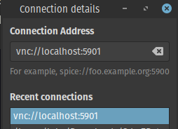
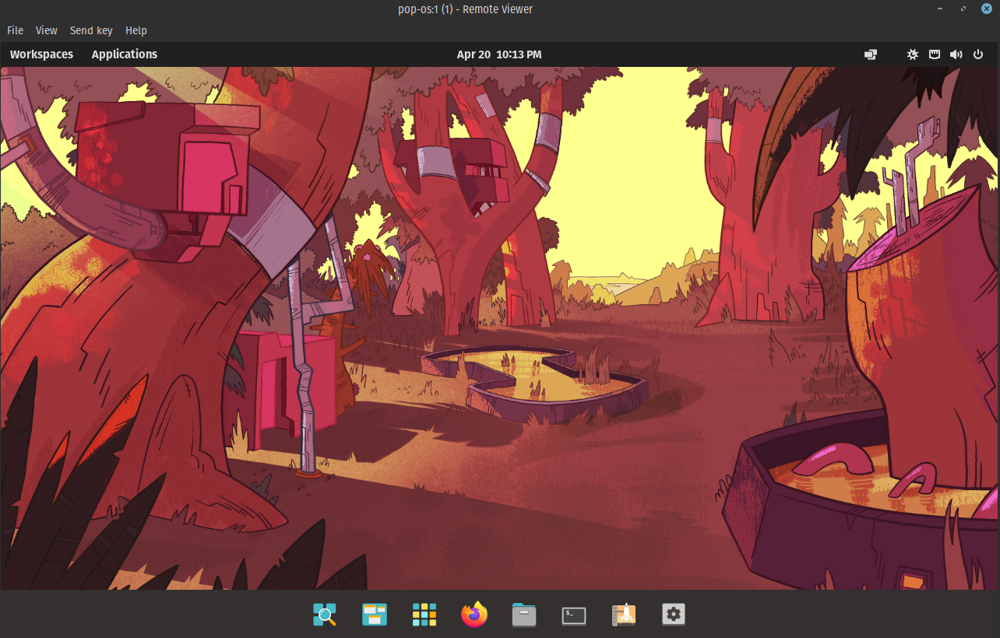

I have 2 linux machines: local and remote. local is the laptop I carry around to different networks--into the office, coffeeshops, library. But I want to be able to log into remote when I need it.

It's pretty simple to do this with tailscale + x11vnc.

## SSH keys

On local: \`ssh-copy-id remote\` and enter the password to save the key.

## Tailscale

On both machines, install and connect tailscale

https://tailscale.com/

(other options would be nebula, zerotier, and others. This post had good comparisons: https://blog.unixfy.net/battle-of-the-mesh-vpns/)

## VNC server

on remote, install packages

\`\`\` sudo apt install x11vnc \`\`\`

run x11vnc to set up password:

\`\`\` x11vnc -usepw \`\`\`

Follow prompts to set and save password; we'll use this later

## ssh config

find tailscale ip of remote using

\`\`\` tailscale ip -4 \`\`\`

then on local, create or edit \`~/.ssh/config\`

\`\`\` Host remote Hostname remote.ip.addr.ess LocalForward 5901 localhost:5901 RemoteCommand x11vnc -localhost -display :1 -usepw -rfbport 5901 \`\`\`

then on local

\`\`\` ssh remote \`\`\`

## Remote viewer

on local, install package:

\`\`\` sudo apt install virt-viewer \`\`\`

launch remote viewer and login to vnc://localhost:5901

Login with the vnc password from earlier

Success!

## Caveats

This (unlike spice) doesn't seem to let you resize on the fly. Also, you have to have already logged in or else it doesn't let you connect. You can have tigervnc server, but it doesn't work quite as nicely as x11vnc.

It might be nicer to do a standalone spice server instead of vnc, but this seems to work well.
