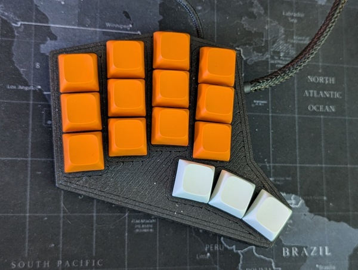
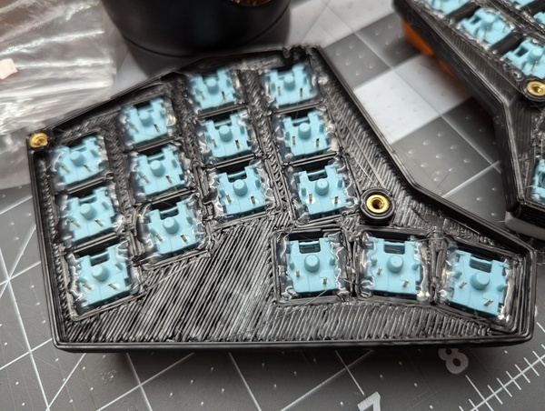
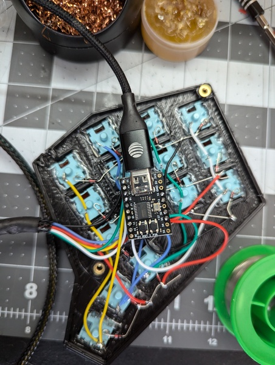
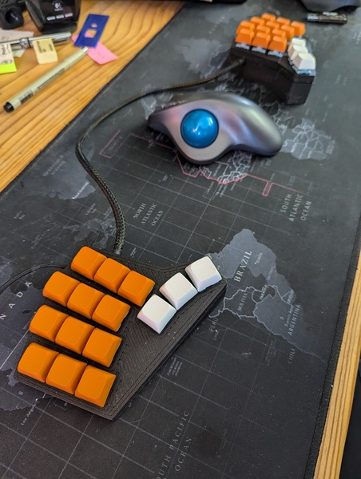
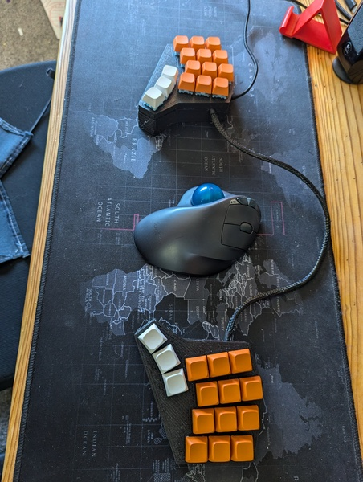

I've posted a few keyboard builds here over the years. Each one was me looking for some kind of efficiency, or just wanting to try something different.

This time, I wanted to solve 3 problems:

- I wanted to move my hands less
- I wanted to really explore layers and combos
- I didn't want to buy more switches, since I had some left over from my last keyboard

Behold, my 30-key descent into madness

This is a handwired, 3d printed keyboard running [FAK firmware](https://github.com/semickolon/fak).

So how does it type? I'm using it to write this post, so it does work for sure.

I'm not up to speed yet, but I love the way my hand stays put. My fingers never need to try to switch columns, but can move up and down within their comfortable lanes. My thumb dances a lot, but every key in the cluster is really easy to hit. So it's really comfortable to use without requiring any weird motion or much work to hit anything.

However, my brain hurts.

There aren't enough keys for all the alphas so I am using 5 layers and 6 combos to hit everything I want. A normal split keyboard would have QWERT across the top row, but this one only has QWER. The "T" (actually "Y" because I'm using dvorak) requires me to chord with my pointer and middle finger. This has taken a lot of work to get used to and is still my main source of typos. Once in a while though I forget I am typing and I just _know_ what to hit. I think this state of flow will grow with me and this will become my fastest keyboard yet.

But for now I'm stuck around 60wpm instead of the 100 I am used to on my earlier tries.

