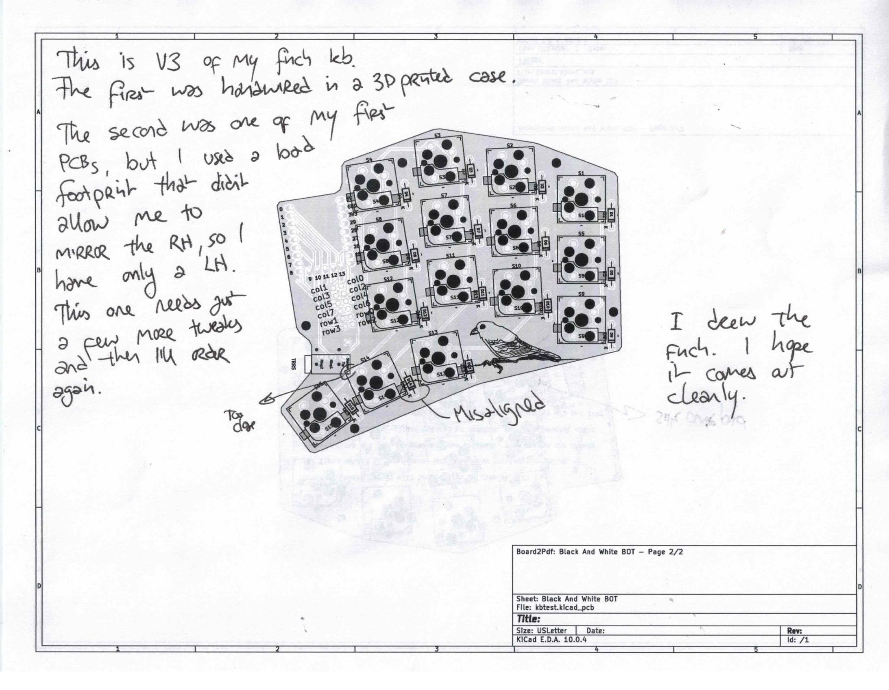

OCR text transcript

This is V3 of my finch kb.
The first was hardwired in a 3d printed case.
The second was one of my
pcbs but I used a bad
footprint that didn't
allow the RH so
have only a LH.
This one needs just
a few more tweaks
and then I'll redo it

I drew the
finch. I hope
it comes
clean.

Top
Rear

Misaligned

Board2pdf Black And White BOT Page 2/2
Sheet: Black And White BOT
File: kbd.pcb
Size: Letter
Date:
Rev: V3

