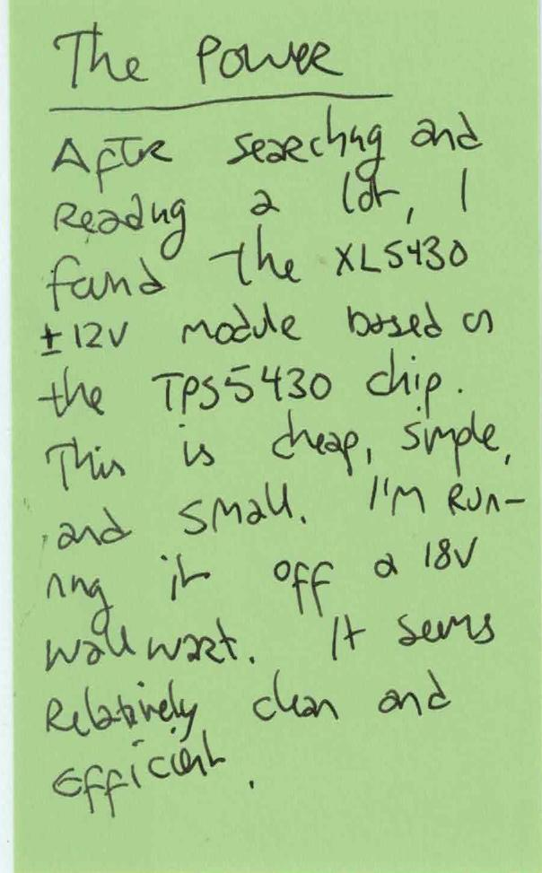

OCR text transcript

The power
After searching and
reading a lot, I found the XL5430
+/- 12V mode based
on the TPS5430 chip.
This is cheap, simple,
and small. I'm run-
ning it off a 18v
wallwart. It seems
relatively clean and
efficient.

