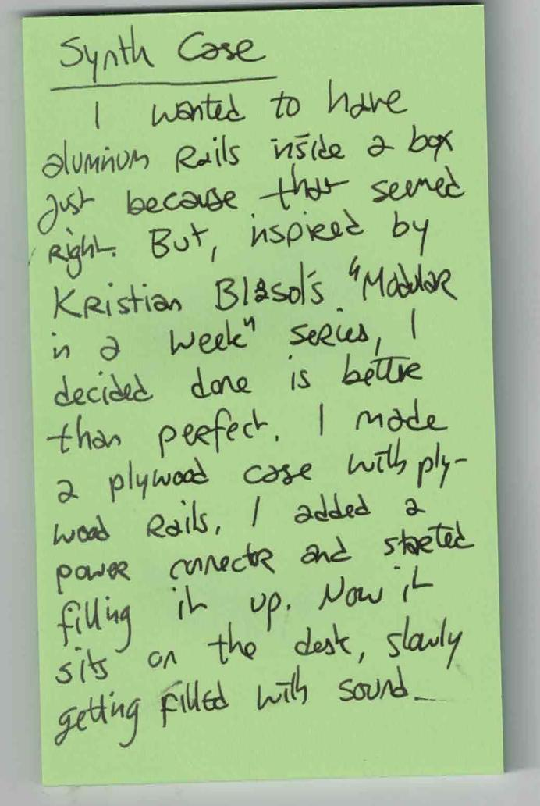

OCR text transcript

Synth Case
I wanted to have
aluminum rails inside a box
just because they seemed
right. But, inspired by
Kristian Blaz's "Modular
in a week" series, I
decided done is better
than perfect. I made
a plywood case with ply-
wood rails, added a
power connector and started
filling it up. Now it
sits on the desk, slowly
getting filled with sound.

