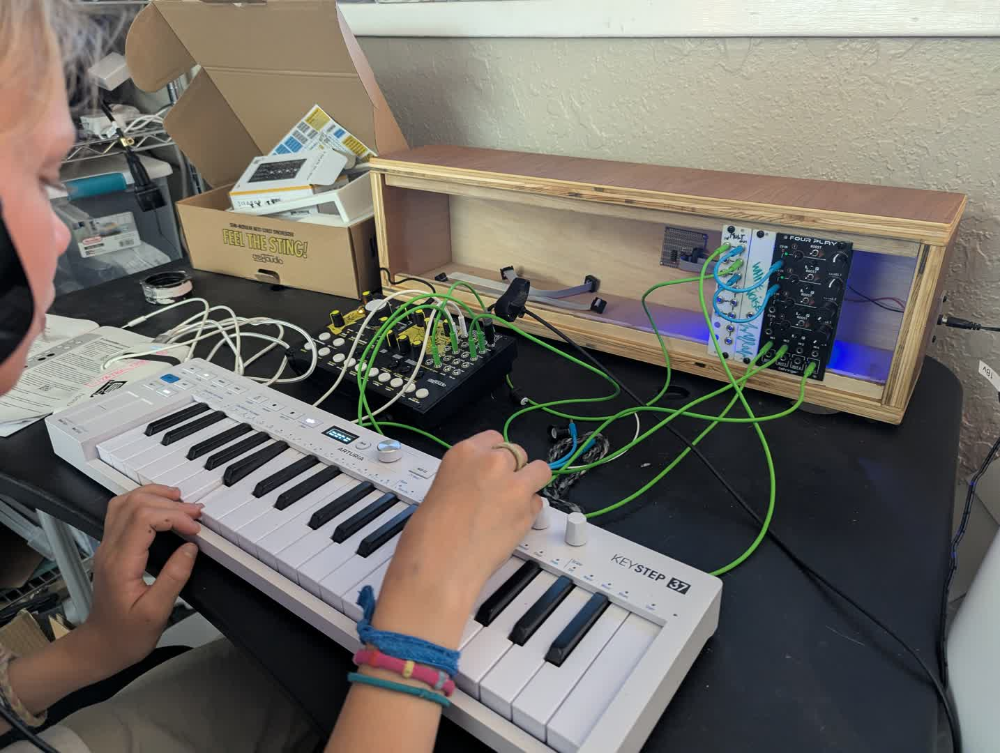

OCR text transcript

Synth Case
I wanted to have
aluminum rails inside a box
just because they seemed
right. But, inspired by
Kristian Blaz's "Modular
in a week" series, I
decided done is better
than perfect. I made
a plywood case with ply-
wood rails, added a
power connector and started
filling it up. Now it
sits on the desk, slowly
getting filled with sound.

## Notes

Reference: [modular in a week](https://www.youtube.com/watch?v=ljJFSOW14Rc&list=PLyE56WXw0_5Q5QGMEXWmskuhojKyRdA3T&index=7)

You'll notice I started with a 'West Pest' by cre8audio. This is a fun little standalone synth with wavefolding. I needed a way to ensure my modules actually worked as I was building things out.

Also, keystep 37 is great. 

Also, I need more cables.

luke
