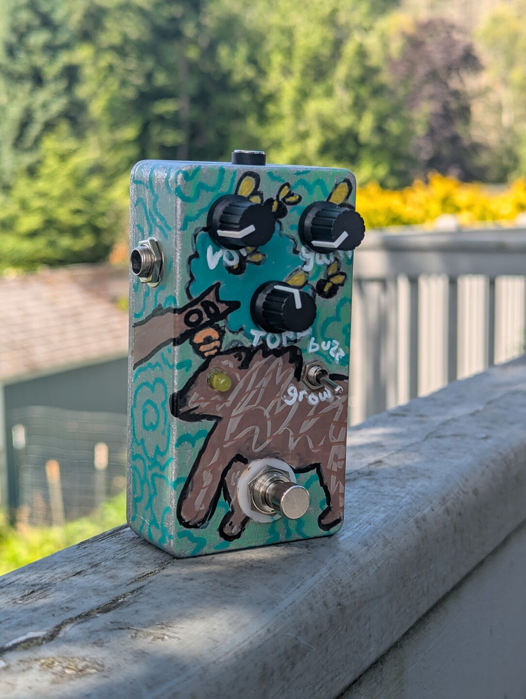
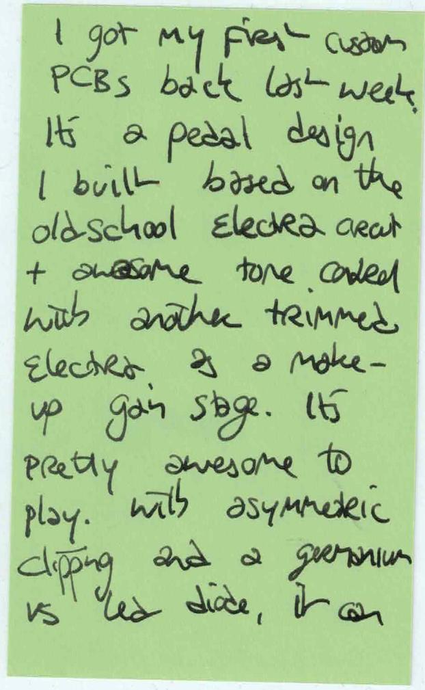
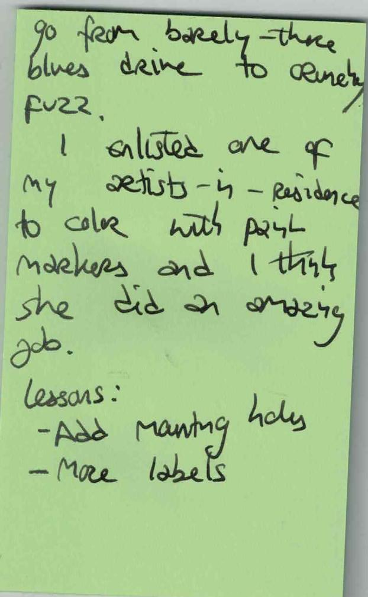
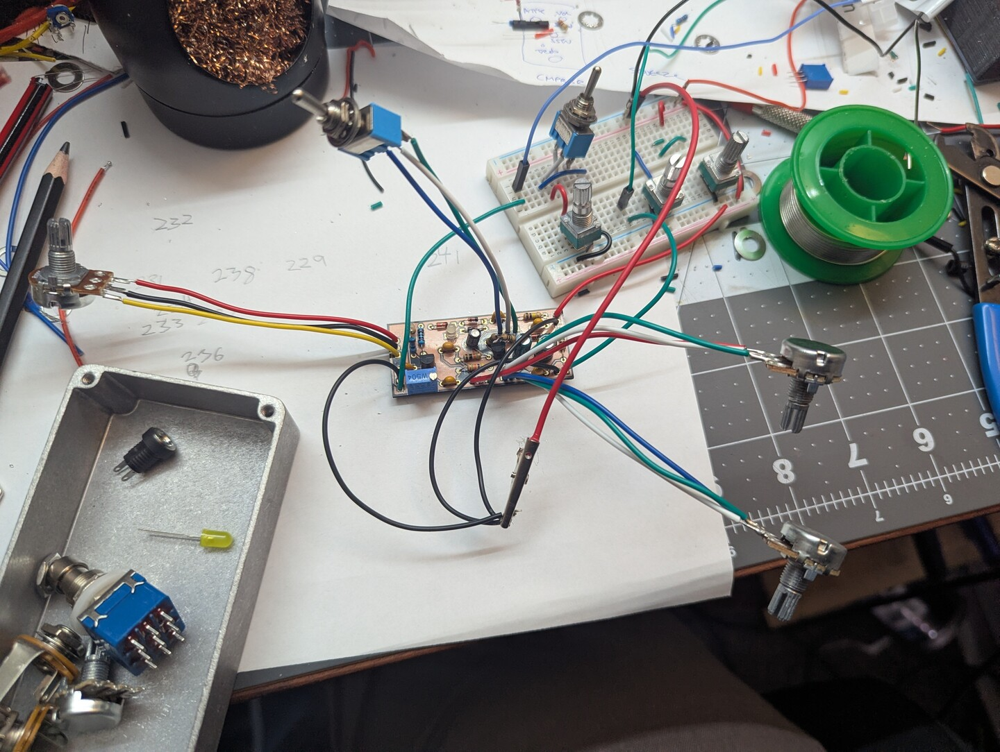
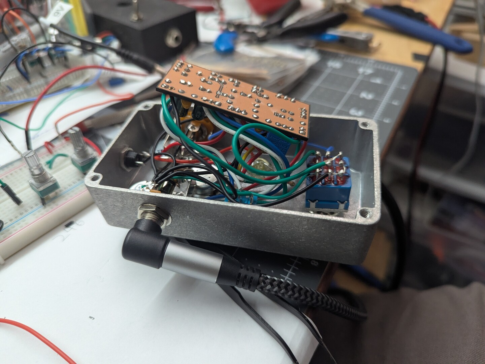
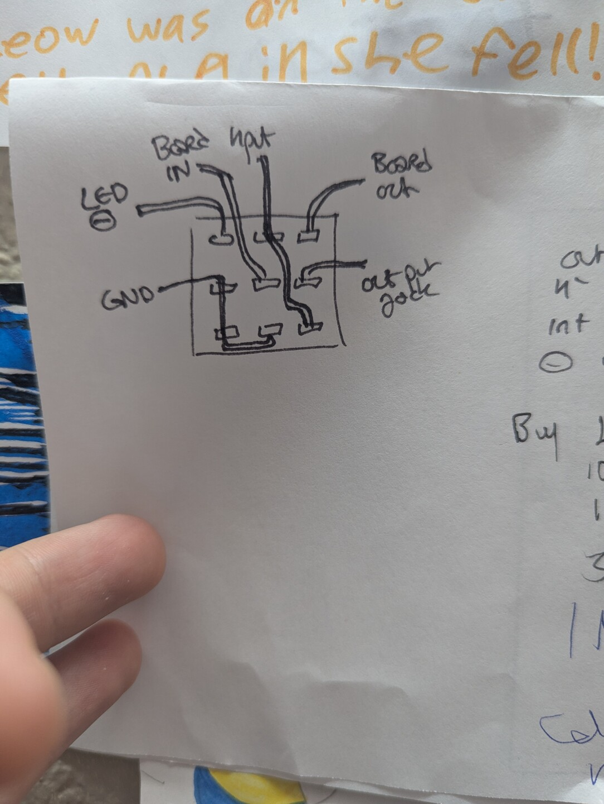

<a href="images/its-an-overdrive.pdf" target="_blank">
  <embed src="images/its-an-overdrive.pdf" type="application/pdf" width="100%" height="600px">
</a>

OCR text transcript

I got my first custom
PCBs back last week.
It's a pedal design
I built based on the
old school electro
sound with another
trimmed electro and a make-
up gain stage. It's
pretty awesome to
play. With asymmetric
dipping and a germanium
vs lead diode, it

---

go from barely-three
blues drive to cindy
fuzz.
I selected one of
my artists in residence
to color with pastel
markers and i think
she did an amazing
job.
Lessons:
- Add more holes
- More labels

